# Report content — blind symbolic interpretation of CMB β-VAE latents

*Built out 2026-08-19 from the skeleton of 2026-08-18, then restructured the
same day: fewer grids, more prose. Every remaining table earns its rows; the
frozen decision rules now sit in the section they govern rather than in one
up-front rulebook. All numbers are the T2-confirmed values from
`experiments/*.json` — no new computation.*

No separate Results part: the pipeline already runs *question → instrument →
result → next question*, so a claim-oriented Part III would restate evidence
the reader has just been given. Claims stay visible by sitting **in the
section titles**; the cards become a cross-stage capstone at the end of
Part II. Nulls are introduced beside their instrument, not deferred.

Dropped: the 2-input amplitude reference study, entirely — including as a
control (§5 carries the self-contained replacement). Retained as a negative
result: the decoder stage, now §8.

**How to read the IDs.** F⟨sec⟩.⟨n⟩ / T⟨sec⟩.⟨n⟩, numbered through the
⟨sec⟩.x subsections; gaps left by dropped items are not renumbered, so IDs
stay stable against the built files. Figures render from
`paper/figs/F<id>_*.png` (PDF twins beside them for print), one script per ID
(`make_fig_F*.py`, shared style in `figstyle.py`). Optional items are marked
*(optional — not built)* and nothing in the argument depends on them.

**Notation.** Symbolic forms are quoted verbatim from the deliverables, in
the sampled basis: `A_s` in an expression means ln 10¹⁰A_s, `tau`/`τ` is
τ_reio, `omega_b`/`ω_b` = ω_b. Per-latent numbers are T2-confirmed card
values unless a tier is named otherwise.

---

## Part I — Setup

### 1. Introduction

Compressors are used as if their latents were physical; they are opaque.
Question: can a latent's content be recovered symbolically *without* telling
the search what to look for? Contributions: a pre-registered blind pipeline,
a validated card for every latent of two checkpoints, and structural findings
about how the encoder organises information.

### 2. Data and models

Two stored β-VAE compressors from the parent `cmbvae` reproduction of Piras,
Herold, Lucie-Smith & Komatsu 2025 (arXiv:2502.09810), both trained on the
same 500,000-sample LHS over ΛCDM parameters → CLASS spectra, both at
β = 3 × 10⁻⁴ with training seed 42, 750 epochs, batch 1024, lr 10⁻³.
`lcdm_tt_beta3e-4` is a **`PirasCVAE` with 5 latents** over the TT channel
alone (2471 bins); `lcdm_tt_ee_lowl` is a **`DualEncoderCVAE` with 6
latents** over TT plus EE-lowl (2471 + 2499 bins). Eleven latents in total.
The SR target throughout is the encoder posterior mean μ_k(θ) over the 50,000
test rows; the stochastic latent Z_k, drawn through the cached logvars,
supplies the intrinsic ceiling of §5. Sources: `models/*/config_used.json`,
`data/meta.json`.

**Data hygiene, frozen before any analysis.** The test split is cut into
three tiers, fixed as constants in `src/cmb_lcdm_sr/tiers.py`: **T0** =
rows [0, 5000) — exactly the slice the SR protocol consumes (4000 fit / 1000
val), so it is precisely the contaminated region and every pre-existing
result stays comparable; **T1** = [5000, 25000) — everything that *fits* on
data (cross-fitted calibration h, residual audits, the 2048 semantic anchors,
level-set pair construction, decoder anchors, probe training); **T2** =
[25000, 50000) — confirmatory numbers only, computed once. The T1/T2 boundary
is what makes the frozen thresholds falsifiable: a threshold crossing
recomputed on the rows an instrument was tuned on is not a test. Every figure
caption below names the tier it draws on.

#### T2.1 — Parameters and priors

The six raw inputs, and the whole of what the search is given. No derived
combination is computed anywhere in the pipeline.

| sampled parameter | symbol | LHS range |
|---|---|---|
| baryon density | ω_b | [0.020, 0.024] |
| CDM density | ω_cdm | [0.100, 0.130] |
| Hubble constant | H₀ | [62, 80] |
| reionization optical depth | τ | [0.01, 0.13] |
| scalar amplitude | ln 10¹⁰A_s | [2.90, 3.18] |
| scalar tilt | n_s | [0.92, 1.01] |

Latin-hypercube, 500,000 samples, seed 42 (`data/meta.json`). The audit basis
u standardises each parameter to its prior box,
u_j = (θ_j − mid_j)/halfwidth_j, in this same sampled basis.

#### F2.1 — data → model → tiers *(optional — not built)*

Three panels: a fan of CLASS spectra over the prior; an encoder/decoder
sketch with μ, logvar and the sampled Z; a tier bar with allowed uses. Only
the tier bar is load-bearing, and it is carried by the hygiene paragraph
above.

#### F2.2 — The raw disentanglement audit fixes the expected roles before any SR

MI between each latent's posterior mean and each raw parameter, all 11
latents × 6 parameters, both checkpoints side by side. This fixes the
audit-expected roles used everywhere downstream — and the boxed (τ, A_s)
columns already carry a structural result §9 returns to: **one** latent
loads on the amplitude pair in TT-only, **two** in TT+EE-lowl (z4
τ-anchored at 0.5/0.3, z5 the combination at 0.3/0.4). That count is
readable from raw parameter MI alone, before any symbolic search has run, so
it is a model-level fact rather than a discovery artifact. Recomputed (KSG)
from `models/*/analysis/encoder_means_test.npy` + `data/theta.npy` on T1
rows, cached in `paper/figs/_cache_audit_mi.npz`. Per-checkpoint scope.

### 3. Blind symbolic interpretation and pre-registered inference

Inputs are raw parameters only; no derived combination is computed anywhere.
The inner loss is a real MI estimator, so it shares an invariance class with
the selection metric: any bijection of either variable leaves both unchanged.
Consequence — the search is rewarded for functional dependence, never for
matching the encoder's calibration.

**The invariance class, and its two corollaries.** Three things sit in a row:
the raw θ the search receives, the GMM-MI inner loss it optimises, and the
held-out `gmm-mi` metric it is selected by. The loss and the metric share one
invariance class — for any bijection g, the composite g∘f scores exactly what
f scores. Picture that as an orbit: a whole family of expressions is
indistinguishable to the pipeline, by construction. Two consequences run
through the rest of the report. First, **the answer is an equivalence class,
not an equation**, which is why §4 cannot report "the" discovered form and
must instead cluster forms by algebraic and statistical equivalence and
report a canonical representative. Second, **the readable physics is whatever
is invariant under that class**, which is why §5 reads exponents off a ratio
of partial derivatives rather than off fitted coefficients — coefficients
move freely within the orbit, ratios of partials do not.

**The GMM-MI inner loss.** PySR optimises `exp(−GMM-MI)` with a pure-Julia
fixed-K = 2 EM density model (N_INNER = 300), ≈80× faster than the
PythonCall route; selection is the full Python `gmm-mi` on held-out rows.
Protocol: 5000 samples (4000 fit / 1000 val), ni200 / pop15 / maxsize20,
5 seeds per config, operators `exp, log, neg, square` and `+ − × ÷`. Using an
MI loss rather than MSE is the reason blindness holds: MI is invariant under
any bijection of either argument, so no calibration of the encoder can be
rewarded.

**Pre-registration.** Every decision rule — sufficiency levels, the knee, the
three equivalence tests, recurrence, subset minimality, the residual audit,
the level-set rule, the gate bullets and the status predicates — was frozen
in `docs/discovery_roadmap.md` §0.3 *before* any shape-latent unblinding, and
validated first on the amplitude sector, whose answer is known (gate G1, §5).
Post-freeze judgement calls are recorded in a deviations register rather than
applied silently; each appears below beside the instrument it touches
(D-P2a/b in §4, R-P5 in §5, D-LS in §7, D-DoD-z2 in §6.x, the three N-G2
flags in §5 and §11). Two post-closure blocks — R-P5 and R-P4 — were
themselves frozen before their own results existed, and are dated in the
roadmap.

#### F3.2 — inner loss vs selection metric *(optional — not built)*

Scatter of the pure-Julia fixed-K = 2 inner MI against the post-hoc full
`gmm-mi` value on held-out rows, for every front expression of one
all-params run, with the ≈80× speedup annotated. Sources would be
`results/<run>/allparams/z*_seed*/` + `experiments/allparams_blind_sr_*`.

---

## Part II — Discovery, validation, and results

### 4. Every latent has a recurrent, low-complexity primary coordinate

Six-input blind SR — all raw parameters into every latent, multiple seeds, no
input or latent pre-selection — returning Pareto fronts; then selection from
those fronts. Generating fronts and choosing the coordinate from them are one
scientific step, not two.

**The frozen selection rules.** Saturation, not argmax: the plateau Î_plat is
the cross-seed mean front maximum of the highest-capacity family, and the
knee **c\* = min{c : M(c) ≥ Î_plat − SE}** with SE the cross-seed std/√n —
the one-SE rule. Simplest forms are reported at η ≥ 0.90 / 0.95 / 0.99, with
"sufficient" defaulting to η ≥ 0.95, and **M@c ≤ 10** kept as a
budget-matched readout for continuity with the sweep tables (it becomes the
selection metric in §11). Recurrence is *semantic*, not string pooling: two
forms join a cluster if any one of three tests fires — identical canonical
sympy form, |Spearman ρ| ≥ 0.98 on the 2048-θ anchors, or gradient distance
d_∇ ≤ 0.05 — union-find clustered, and **R_SR** is the fraction of seeds
whose front carries a cluster member at knee level, with "stable" at ≥ 0.8
and "primary" at ≥ 0.6. Two registered deviations live here: **D-P2a**, the
seed-level R_SR tolerance is one cross-seed SD rather than the SE-of-mean the
§0.3 wording implies (the literal rule caps R_SR near 0.7 by seed scatter
alone, even for a perfectly stable coordinate), and **D-P2b**, an
anti-chaining guard requiring cluster representatives to be directly
equivalent to a majority of sampled members, with cohesion reported per
cluster (0.61–1.00).

**The hyperparameter finding.** Top-front MI is a **capacity dial** — maxsize
alone swings it 1.6 → 4.05 nat — while the budget-matched M@c ≤ 10 is **flat**
across every knob (~1.89 TT / ~2.02 EE), and the maxsize-10 search's own
front is *worse* at c ≤ 10 than the sliced maxsize-20 front (1.60 vs 1.89 TT;
1.69 vs 2.02 EE). Complexity is a report-time slice, not a search-time
budget: search broadly, slice afterward (`experiments/hpsweep_hp_v1_*`).

→ *Result*: a recurrent primary coordinate for every latent; every latent is
a multi-parameter composite (top forms use ≥ 5 of 6 parameters); the −2
direction already appears in the unrestricted search.
→ *Raises*: does f₁ actually account for the latent?

#### F4.1 — Cumulative Pareto envelopes, both checkpoints, with the null in-panel

Validation MI against expression complexity per latent: the combined
envelope (heavy line) over the per-family means (ms10/20/30, faint), the
plateau ± SE band, and the one-SE knee c\* marked. The **shuffled-target
control** is drawn in the same axes at the bottom of each row — ≤ 0.06 nat
against real plateaus of 1.79–4.31 nat — so the null sits beside its
instrument rather than in a caption. Sources:
`experiments/knee_readout_*.json`, `allparams_blind_sr_*.json` (control
band). T0-val fronts; per-checkpoint scope.

#### T4.1 — Primary coordinates, discovery columns

Validation columns (η ladder, level sets, status) deliberately wait for §5–§7.

**TT-only (`lcdm_tt_beta3e-4`)**

| z | audit-expected role | canonical f₁ | C | c₀.₉₀ | c\* | Î_plat ± SE [nat] | M@c ≤ 10 | R_SR | seeds carrying the cluster (ms10 / ms20 / ms30) | forms pooled |
|---|---|---|---:|---:|---:|---|---:|---:|---|---:|
| 0 | ω_b | `n_s/omega_b` | 3 | 16 | 26 | 3.570 ± 0.059 | 2.561 | 1.00 | 5/5 · 4/5 · 3/3 | 157 |
| 1 | ω_cdm | `H0**2*n_s**2*omega_b/(A_s*omega_cdm**2)` | 10 | 19 | 29 | 2.515 ± 0.013 | 1.211 | 0.80 | 3/5 · 4/5 · 2/3 | 103 |
| 2 | amplitude (A_s, τ) | `A_s/log(H0*(omega_cdm + tau))` | 8 | 19 | 24 | 4.175 ± 0.043 | 1.891 | 1.00 | 4/5 · 3/5 · 3/3 | 446 |
| 3 | n_s | `n_s + omega_cdm` | 3 | 13 | 27 | 3.147 ± 0.030 | 2.279 | 1.00 | 4/5 · 5/5 · 3/3 | 141 |
| 4 | H₀ | `A_s*H0**2*omega_cdm*exp(-2*tau)` | 9 | 21 | 24 | 4.313 ± 0.120 | 1.318 | 0.80 | 4/5 · 4/5 · 2/3 | 101 |

**TT+EE-lowl (`lcdm_tt_ee_lowl`)**

| z | audit-expected role | canonical f₁ | C | c₀.₉₀ | c\* | Î_plat ± SE [nat] | M@c ≤ 10 | R_SR | seeds carrying the cluster (ms10 / ms20 / ms30) | forms pooled |
|---|---|---|---:|---:|---:|---|---:|---:|---|---:|
| 0 | ω_cdm / early-ISW | `omega_cdm/(H0*n_s*omega_b)` | 7 | 12 | 19 | 1.788 ± 0.008 | 1.457 | 1.00 | 5/5 · 4/5 · 2/3 | 119 |
| 1 | H₀ | `H0**2*omega_cdm` | 4 | 20 | 25 | 4.006 ± 0.045 | 1.952 | 1.00 | 5/5 · 4/5 · 2/3 | 133 |
| 2 | ω_b | `omega_b/n_s**2` | 4 | 10 | 22 | 3.330 ± 0.020 | 3.057 | 1.00 | 5/5 · 4/5 · 3/3 | 145 |
| 3 | n_s | `log(omega_b)/(n_s + omega_cdm)` | 6 | 13 | 18 | 3.212 ± 0.071 | 2.048 | 0.80 | 4/5 · 4/5 · 2/3 | 145 |
| 4 | τ (amplitude sector) | `-A_s/(tau - 0.4454238)` | 5 | 17 | 20 | 2.370 ± 0.082 | 1.905 | 1.00 | 4/5 · 4/5 · 3/3 | 160 |
| 5 | amplitude (A_s, τ) | `A_s*exp(-2*tau)` | 5 | 18 | 28 | 4.087 ± 0.004 | 2.019 | 1.00 | 5/5 · 4/5 · 3/3 | 461 |

**The envelope shape is itself a result.** The readout classifies each
envelope from c₀.₉₀ — the smallest complexity reaching 0.90 × Î_plat — against
a "simple" budget fixed at c ≤ 10: a *single dominant knee* needs c₀.₉₀ and
c\* both ≤ 10, *knee + slow climb* needs c₀.₉₀ ≤ 10 < c\*, and anything with
c₀.₉₀ > 10 is *no knee (diffuse)*. **No latent in either checkpoint is a
single dominant knee.** Ten of eleven are diffuse; EE z2 alone is
"knee + slow climb", and only just — c₀.₉₀ = 10 exactly, where
`omega_b + 0.00186799373923218*(n_s - omega_cdm)*log(A_s)` reaches η = 0.933
before the envelope climbs on to c\* = 22. So front information is spread
over complexity rather than concentrated in one cheap form: the search keeps
finding real MI as complexity is spent. That is the first face of the
non-terminating hierarchy §5 and §6 meet again as structured residuals.

R_SR on the cards is the maximum over protocol families; the per-family seed
fractions are given so the reader can see the recurrence is not a
single-family artifact. "Forms pooled" is the number of distinct front
expressions the semantic clustering absorbed into the latent's dominant
cluster. Sources: `experiments/knee_readout_*.json`,
`semantic_recurrence_*.json`. T0-val.

#### F4.3 — recurrence matrix *(optional — not built)*

Latents × seeds, cell colour = semantic cluster of the knee-slice form. The
per-family fractions in T4.1 carry the same information in text.

---

### 5. Primary coordinates saturate their own support but not the full latent

The central tension, and the reason "interpreted" needs a precise definition.
Four instruments, each with its null: sensitivity signatures and the
answer-agnostic **constant-ratio detector**; the **exhaustive subset
campaign** (all 63 non-empty supports) giving support-restricted ceilings;
the **intrinsic ceiling** from the stochastic latent; and **calibrated
sufficiency** — 5-fold cross-fitted monotone recalibration followed by a
residual audit against permutation nulls.

**The η ladder.** Three ratios that are otherwise conflated, and separating
them is what makes the section's claim precise:

* **η_S = Î(f) / Î_S** — against the support-restricted ceiling from the
  63-subset campaign. *Does f saturate its own variables?* Fronts on T0-val,
  card value confirmed on T2. This is a status predicate: η_S ≥ 0.95.
* **η_plat = Î(f) / Î_plat** — against the empirical plateau of the
  highest-capacity front. *What fraction of the searchable mean map does f
  capture?* T0-val. A reporting level, never a status gate.
* **η̂_post = MI(Z_k; f) / MI(Z_k; μ_k)** — against what the stochastic
  latent actually transmits. *What fraction of what the latent physically
  stores does f carry?* T2. This is the demotion metric under the 0.95 rule;
  the analytic η_post = Î(Z;f)/Î(Z;θ) stays the headline.

A latent can honestly score η_S = 1.00 and η_plat = 0.35. That distinction is
what makes "primarily interpreted" a status rather than a hedge. The choice
of η̂_post over η_post as the *decision* metric is registered deviation
**R-P5**, decided on a synthetic positive control before any real data; the
two agree to ≤ 0.03 on every latent.

**The other frozen rules used here.** Subset minimality: **S\*** is the
smallest |S| (ties broken toward smaller complexity) whose η_S sits within
1 SE of the best over all supersets, and recurrent across screen seeds. The
**residual pass** requires cross-fitted R²(e ← θ) ≤ 0.05 **and**
max_j Î(e; θ_j) ≤ the permutation null's 97.5th percentile — both legs, or it
fails.

→ *Positive control, self-contained*: the amplitude latents' {A_s, τ} entry
in the subset campaign is the reference. The frozen machinery must rediscover
that support, saturate against its own ceiling, recover the exponent, **and**
still report the residual as structured — a control that can fail in both
directions. **Gate G1 PASSES on both models** (η_S = 1.000 TT / 1.015 EE,
r recovered, residual correctly failing structured).
→ *Result*: η_S ≈ 1 while η̂_post(f₁) < 1, with every stage-1 residual
structured. Each f₁ saturates its own variables yet accounts for only part of
what its latent physically stores. The instruments do not fabricate
sufficiency.
→ *Raises*: what is in the residual?

#### F5.1 — The η ladder, per latent: saturation of own support, not of the latent

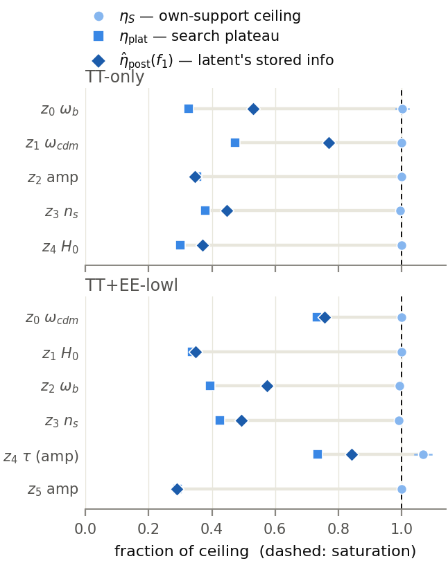

The report's central quantitative figure. For each of the 11 latents, three
aligned markers: η_S (light circle, essentially pinned at the dashed
saturation line), η_plat at the knee slice (square), and η̂_post(f₁)
(diamond). The visible gap between η_S ≈ 1 and η̂_post < 1 *is* the claim in
the section title. EE z4 sits past 1.0 at η_S = 1.068 ± 0.026: the canonical
coordinate scores above the cross-seed mean ceiling of its own minimal
support {ω_b, τ, A_s} — Î_S is an empirical front maximum, not an analytic
bound, so a ratio slightly above 1 is a statement about the ceiling estimate,
not about super-saturation. Card ordering, both checkpoints. Sources:
`experiments/latent_cards_*.json` (T2-confirmed rungs), backed by
`sufficiency_audit_*.json` and `posterior_ceiling_*.json`. Per-checkpoint
scope.

#### F5.2 — Subset-campaign staircases, with the amplitude panels as positive control

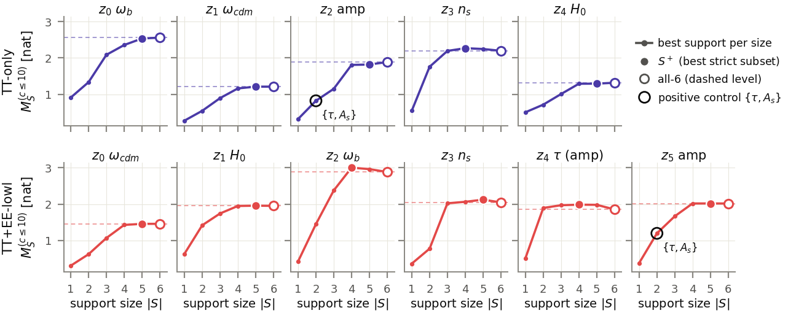

Small multiples, one per latent: the best support-restricted ceiling against
support size |S| over the complete 63-support × 5-seed full-protocol grid
(budget-matched M_S^(c≤10)), with S⁺ (filled) and the all-6 point (open, on
its dashed level line) marked. The amplitude panels double as the positive
control: the {τ, A_s} support is ringed at |S| = 2 in TT z2 and EE z5 — the
machinery finds the pair among all 63 supports with no special status, and it
sits well below the all-6 level. That gap *is* the **superset finding**: the
all-parameter ceiling beats {A_s, τ} by more than 1 SE because the
shape-sector modulation is real information, so G2 records "PASS (superset
finding)" rather than a failure of minimality. The control is armed in both
directions — it would have failed had the machinery fabricated saturation on
a wrong support, and equally had it missed the structured residual. Minimal
supports run |S| = 3 (EE z4: {ω_b, τ, A_s}) to 6. Three latents carry N-G2
attention flags for a screen-seed non-recurrence (TT z0, EE z3, EE z4); all
three are dispositioned in §11. Source: `experiments/subsets_full_*.json`
(definitive; the screen-era `subset_selection_*` is retained for provenance).

#### F5.3 — The stage-1 residual's structure, seen

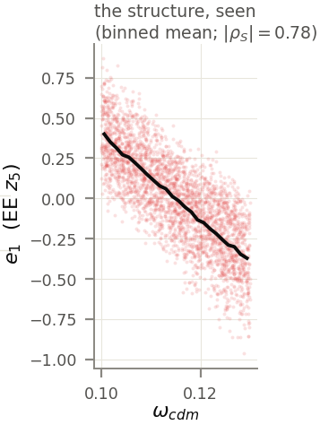

The EE amplitude latent's residual e₁ = μ − h(f₁) against ω_cdm, its leading
residual direction, with the binned mean overlaid (|ρ_S| = 0.78) on a T1
subsample. The residual is not noise, and it is worth seeing that rather than
only scoring it. Sources: `models/*/analysis/residual_z*_v1.npy` +
`data/theta.npy`.

**What the audit finds across all 11.** After 5-fold cross-fitted monotone
recalibration the calibration itself is good — R²_cal 0.904–0.955, so h(f₁)
is a genuine account of each latent's leading behaviour — and yet the
residual left over is strongly predictable from the raw parameters, at
R²_res 0.960–0.994 against permutation nulls pinned at p97.5 ≈ ±0.002. The
frozen rule wants R² ≤ 0.05, so the first leg alone fails by a factor of
≈ 20. The second leg fails too, and by a wider margin: the largest
per-parameter MI between the residual and a raw parameter sits far above its
own permutation null, which is 0.001 nat for nine of the eleven latents
(0.014 for EE z0, 0.019 for EE z4).

| model | z | max_j MI(e₁; θ_j) [nat] |
|---|---|---|
| TT | 0 | 0.450 (ω_cdm) |
| TT | 1 | 0.393 (n_s) |
| TT | 2 | 0.199 (ω_cdm) |
| TT | 3 | 0.440 (ω_cdm) |
| TT | 4 | 0.596 (ω_b) |
| EE | 0 | 0.220 (ln10A_s) |
| EE | 1 | 0.357 (ω_b) |
| EE | 2 | 0.640 (ω_cdm) |
| EE | 3 | 0.548 (ω_cdm) |
| EE | 4 | 0.690 (τ) |
| EE | 5 | 0.455 (ω_cdm) |

The loadings are full-sector, not confined to the coordinate's own support:
all six parameters sit above their null for eight latents, five of six for
EE z2 and EE z3, four of six for EE z5. The residual audit therefore returns
**FAIL for all 11**.

"FAIL" on all 11 is the informative outcome: an instrument reporting PASS on
these residuals would be fabricating sufficiency. The negative control
confirms the audit's other direction — shuffled coordinates explain ≈ nothing
of the true latent (MI 0.001–0.245, R²_cal 0.05–0.38), so their residual is
the latent itself and R²_res is trivially ≈ 0.99, which the audit correctly
reports as *total* insufficiency. Source:
`experiments/sufficiency_audit_*.json`. T1 calibration, T2 confirmation.

#### F5.4 — Sensitivity signatures: what each discovered form actually depends on

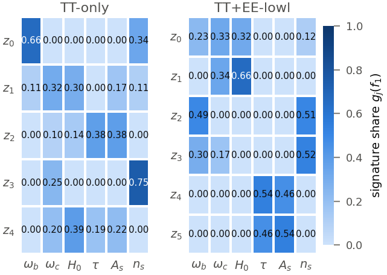

Heatmap of the normalised signature g_j = E|∂f/∂u_j| of each canonical f₁
over the six parameters, both checkpoints. This is the object the
constant-ratio detector reads, and the object §8 compares against the
decoder-side loadings through cos(a\*, g_j). Read beside F2.2 it gives the
audit-expected role and the discovered-form signature side by side — the
amplitude latents (TT z2: τ 0.38 / lnA_s 0.38; EE z5: τ 0.46 / lnA_s 0.54;
EE z4: τ 0.54 / lnA_s 0.46) concentrate on the pair; the shape latents do
not touch it. Source: `experiments/sufficiency_audit_*.json`. T1 anchors.

#### T5.3 — Intrinsic ceilings and the posterior-SNR fork

| model | z | I(Z_k; θ) ± SE [nat] | posterior SNR | η_post(f₁) | η̂_post(f₁) | η̂_post(f₁+f₂) |
|---|---|---|---:|---:|---:|---:|
| TT | 0 | 1.984 ± 0.002 | 55.4 | 0.545 ± 0.005 | 0.531 ± 0.006 | 0.903 |
| TT | 1 | 0.919 ± 0.003 | 5.1 | 0.761 ± 0.014 | 0.770 ± 0.018 | 0.957 |
| TT | 2 | 4.304 ± 0.003 | 5490.8 | 0.347 ± 0.003 | 0.347 ± 0.003 | 0.601 |
| TT | 3 | 2.646 ± 0.003 | 204.7 | 0.449 ± 0.004 | 0.447 ± 0.004 | 0.838 |
| TT | 4 | 3.441 ± 0.003 | 986.5 | 0.370 ± 0.004 | 0.371 ± 0.004 | 0.758 |
| EE | 0 | 1.343 ± 0.003 | 11.5 | 0.737 ± 0.009 | 0.756 ± 0.012 | 0.842 |
| EE | 1 | 3.835 ± 0.003 | 2179.5 | 0.352 ± 0.003 | 0.348 ± 0.004 | 0.663 |
| EE | 2 | 2.180 ± 0.003 | 78.6 | 0.576 ± 0.006 | 0.574 ± 0.006 | 0.963 |
| EE | 3 | 2.724 ± 0.003 | 234.1 | 0.493 ± 0.005 | 0.493 ± 0.005 | 0.864 |
| EE | 4 | 1.535 ± 0.003 | 17.7 | 0.811 ± 0.006 | 0.842 ± 0.011 | 0.842 |
| EE | 5 | 4.176 ± 0.003 | 4278.3 | 0.290 ± 0.003 | 0.289 ± 0.003 | 0.590 |

The SNR column carries the G3 fork. The amplitude posteriors are
near-deterministic (TT z2 at 5,491; EE z5 at 4,278), so their structured
stage-1 residuals cannot be dismissed as sub-noise detail — they are *real
stored information*. DPI sanity holds for every candidate and **G3 PASSES on
both models**. Source: `experiments/posterior_ceiling_*.json`. T2.

---

#### 5.x The amplitude sector, recovered blind

The −2 evidence collected in one place, though it arises at different points
of the pipeline. No textbook reference exists anywhere in the pipeline, the
readouts are methodologically independent, and the two checkpoints agree.

##### F5.5 — The amplitude latent against the textbook combination

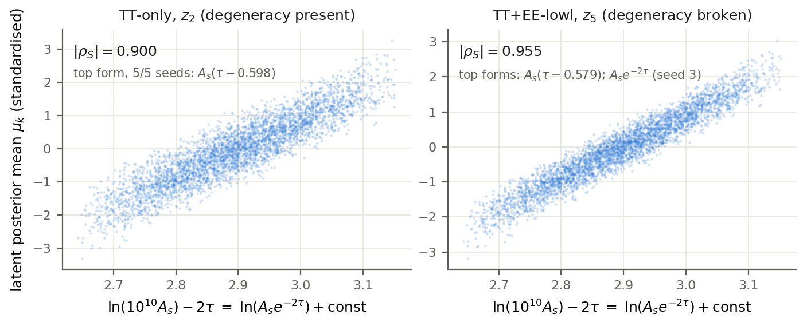

μ_amp plotted against ln(A_s·e^{−2τ}) for both checkpoints: tight monotone
curves. The textbook combination is drawn here only to *display* the result —
it is computed nowhere inside the pipeline. Built by
`paper/figs/make_fig_amplitude.py`.

##### T5.2 — Every blind readout of the −2

**Readout 1 — the discovered forms themselves.** EE z5's canonical
coordinate is the **literal** `A_s*exp(-2*tau)` (complexity 5, R_SR 1.00,
cluster cohesion 1.00), recovered from a search that was never shown the
combination. TT's knee-slice amplitude form is the affine `A_s*(tau − 0.598)`
and EE's `A_s*(tau − 0.579)`; both constants match the Taylor prediction
c = τ̄ + ½ ≈ 0.570 to within 1.5–5%. Sources: `semantic_recurrence_*`,
`docs/method.md` §3.

**Readout 2 — the derivative ratio over all top forms.** Taking
r = (∂f/∂τ)/(∂f/∂lnA_s) at the prior midpoint across every top form of the
unrestricted 6-input search gives **−1.974 ± 0.018** (TT, n = 5) and
**−1.993 ± 0.008** (EE, n = 5). This is a property of the whole front, not of
one lucky expression, and it holds in every hyperparameter configuration
(r ≈ −1.97 … −2.00). Source: `experiments/allparams_blind_sr_*`.

**Readout 3 — the frozen, answer-agnostic ratio detector.** The Phase-3 ratio
field ρ_ij = (∂f/∂u_i)/(∂f/∂u_j) flags any parameter pair whose ratio is
constant at cv < 5%; it is not told which pair to look at. The (τ, lnA_s)
pair emerges with **r_raw = −2.0000** (cv 0.000, valid on 100% of anchors) on
the cards of TT z4 and EE z5. The G1 knee-slice latent-level readouts agree:
r_lin = −1.977 (TT, stored −1.988) and −1.995 (EE, stored −1.9995). Sources:
`sufficiency_audit_*`, `latent_cards_*`.

**No fourth readout — the observable domain declines.** The decoder-template
route of §8 does *not* produce one. The (τ, lnA_s) templates are
near-antiparallel in both designs, so the fitted amplitude split drifts along
a degenerate ridge: EE's −1.87 is one point on it (−1.67 to −2.32 across fit
variants) and TT gives +0.351 (spanning +0.60 → −2.85). G4b FAILS on both
models. All three surviving readouts are encoder-side.

**A fourth appearance, unplanned — inside another latent's residual.** The
EE H₀ latent's *second-stage* coordinate is literally
`A_s*exp(-2*tau)/omega_b**2`, whose (τ, lnA_s) ratio is **−2.0000** at
cv 0.000 — found twice, by two independent searches (Phase 6, and again by
the interaction-aware rerun of §6.x). Sources: `residual_sr_*`,
`residual_sr_ia_*`.

Both regimes matter, and their agreement is the result: TT is the degeneracy
*present* arm (the latent is forced into the combination), EE the degeneracy
*broken* arm (the model could separate A_s and τ, yet the amplitude latent
still organises as `A_s·e^{−2τ}`).

##### F5.7 — Why TT reports an affine form and EE the literal exponential

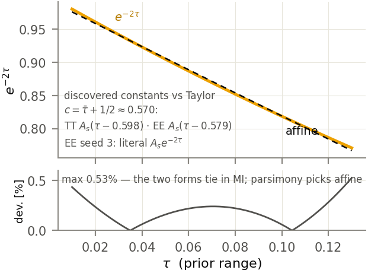

exp(−2τ) over the prior range τ ∈ [0.01, 0.13] with its best affine fit; the
deviation panel below shows a maximum of 0.52%. The two forms therefore tie
in MI, and parsimony deterministically prefers the cheaper affine one — so
the TT/EE difference is *structural*, not seed luck. Pure function plot;
constants from `docs/method.md` §3e.

---

### 6. The latent map contains structure beyond two symbolic coordinates

Blind SR on the stage-1 residual e₁ = μ − h(f₁), all inputs again;
hierarchical account h(f₁) + g(f₂); then an interaction-aware rerun exposing
the stage-1 prediction f1hat = h(f₁) as an extra input. Null: shuffled
residuals.

→ *Result*: a recurrent second coordinate for every latent and a large gain
in η̂_post — but stage-2 residuals remain structured under both the additive
and the enriched ansatz. What is *global* is persistence beyond two
coordinates.
→ *Raises*: is the failure to close a property of the representation, or of
the additive ansatz?

#### F6.1 — What the second coordinate buys

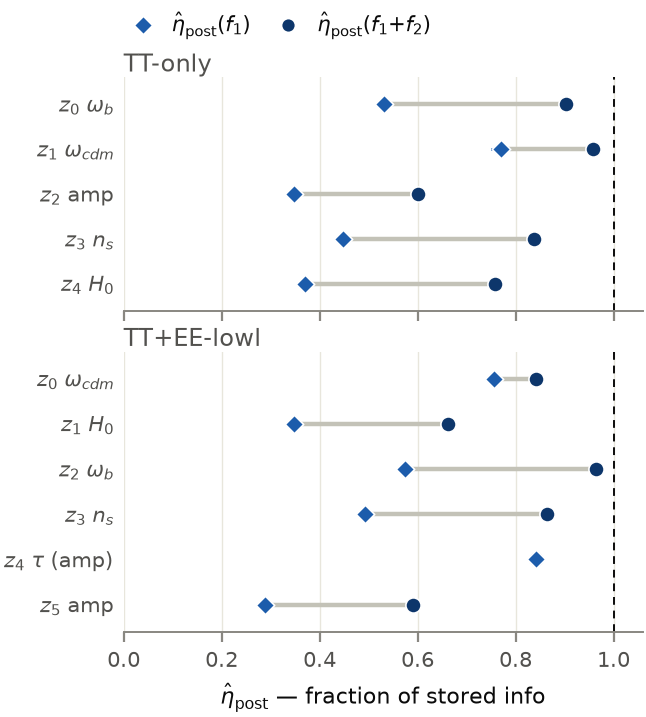

Per latent, a dumbbell from η̂_post(f₁) to η̂_post(f₁+f₂): 0.29–0.84 lifted to
0.59–0.96, against the dashed saturation line at 1.0. Every latent gains, and
no latent arrives. EE z4 is the one collapsed dumbbell (0.842 → 0.842): its
f₂ is the bare `tau`, which a 1-D monotone recalibration cannot add to an
account already built on `-A_s/(tau - 0.445)`. Source:
`experiments/latent_cards_*.json`. T2.

#### T6.1 — Second coordinates

Own-latent probe R² is borrowed from §9's instrument and placed here so §9
can stay descriptive.

**TT-only**

| z | canonical f₂ | support | shape-sector | R_SR | MI(f₂; e₁) ± SE | R²(e₁) | combined R²(μ) | η̂_post(f₁+f₂) | own-latent probe R² |
|---|---|---|---|---:|---|---:|---:|---:|---:|
| 0 | `n_s*(H0 + 1325.0747*omega_cdm)` | {ω_cdm, H₀, n_s} | yes | 0.80 | 1.106 ± 0.011 | 0.887 | 0.989 | 0.903 | 0.012 |
| 1 | `n_s/log(-H0/(tau - 0.44653893)) + omega_b` | {ω_b, H₀, τ, n_s} | no | 0.80 | 0.888 ± 0.014 | 0.802 | 0.981 | 0.957 | 0.056 |
| 2 | `n_s**2*omega_b*tau/(omega_cdm*tau + 0.00031008976)` | {ω_b, ω_cdm, τ, n_s} | no | 0.80 | 1.058 ± 0.012 | 0.864 | 0.993 | 0.601 | 0.010 |
| 3 | `H0/(omega_b**2*omega_cdm**2)` | {ω_b, ω_cdm, H₀} | yes | 0.80 | 1.087 ± 0.014 | 0.863 | 0.989 | 0.838 | 0.256 |
| 4 | `log(H0)/(n_s*omega_b)` | {ω_b, H₀, n_s} | yes | 0.80 | 1.186 ± 0.013 | 0.908 | 0.993 | 0.758 | 0.224 |

**TT+EE-lowl**

| z | canonical f₂ | support | shape-sector | R_SR | MI(f₂; e₁) ± SE | R²(e₁) | combined R²(μ) | η̂_post(f₁+f₂) | own-latent probe R² |
|---|---|---|---|---:|---|---:|---:|---:|---:|
| 0 | `A_s*H0*omega_cdm/n_s` | {ω_cdm, H₀, lnA_s, n_s} | no | 0.80 | 0.401 ± 0.010 | 0.406 | 0.955 | 0.842 | 0.057 |
| 1 | `A_s*exp(-2*tau)/omega_b**2` | {ω_b, τ, lnA_s} | no | 0.80 | 1.281 ± 0.013 | 0.921 | 0.995 | 0.663 | 0.062 |
| 2 | `n_s*(A_s + 1.03524857872784e-5*omega_b*omega_cdm**2)` | {ω_b, ω_cdm, lnA_s, n_s} | no | 0.80 | 1.765 ± 0.013 | 0.966 | 0.998 | 0.963 | 0.083 |
| 3 | `H0/omega_cdm**2` | {ω_cdm, H₀} | yes | 0.80 | 1.065 ± 0.013 | 0.880 | 0.992 | 0.864 | 0.221 |
| 4 | `tau` | {τ} | no | 0.80 | 0.702 ± 0.011 | 0.033 | 0.957 | 0.842 | 0.583 |
| 5 | `H0*omega_cdm/n_s` | {ω_cdm, H₀, n_s} | yes | 0.80 | 1.250 ± 0.014 | 0.919 | 0.993 | 0.590 | 0.081 |

**Null floor for the MI column.** Shuffled-residual SR reaches 0.066–0.074
nat against the true TT z2 residual and 0.009–0.060 against EE z5. The
largest null anywhere (0.074) sits 5.4× below the *smallest* real value
(0.401) and 24× below the largest (1.765). Every stage-2 residual fails the
frozen audit. EE z1's f₂ is the fourth appearance of the −2 (§5.x). Sources:
`experiments/residual_sr_*.json`, `subspace_probe_*.json`. T2 for the η and
R² columns.

---

#### 6.x A multiplicative amplitude–shape interaction defeats the additive hierarchy

The specific mechanism, demonstrated in the TT amplitude latent: the knee
forms are amplitude × shape, and an additive two-level account cannot absorb
a multiplicative interaction. The pre-registered separation test — the
amplitude "definition of done", that f₂'s support be pure shape-sector — is
MET on EE with f₂ = `H0*omega_cdm/n_s` and NOT MET on TT, recorded as
deviation **D-DoD-z2**. Substantively: TT z2's f₂ keeps τ, and τ-clamping it
costs 0.20 nat of MI against e₁ (Spearman 0.92 < 0.98, d_∇ 0.127 > 0.05
against the shape-only approximant).

The interaction-aware rerun settles whether that is real structure or an
omission from the search ansatz: 55 runs plus 6 controls, 98 core-h, with
f1hat = h(f₁) exposed as a 7th input and reconstructed exactly (T2
reconstruction error 0.00e+00 on every latent). Three verdicts.

**D-DoD-z2 is real structure, not an ansatz artifact.** Given the chance to
express the interaction directly, TT z2's search returns the *same* τ-bearing
knee coordinate as the additive run and does not use f1hat at all — even
though the search demonstrably used f1hat elsewhere in the same batch. The
additive hierarchy is not failing for want of expressiveness.

**EE z0 upgrades but stays unresolved.** Its f₂ becomes the *unanimous*
interaction form `-A_s*H0**2*(f1hat - 10.8708105)`, lifting R_SR from 0.80 to
1.00 and MI against e₁ from 0.401 to 0.499 — yet the joint level sets barely
move, 0.060 → 0.062 ± 0.002 (T2 0.067, predicted band 0.046–0.093). The
stage-2 residual is still only R² 0.39. This latent needs a third coordinate,
not a better second one.

**The additive account is otherwise robust.** Eight of eleven latents return
the identical canonical f₂ under the enriched space — identity by the frozen
semantic-equivalence tests, not string match; TT z0's representative differs
only in a fitted constant (1325.07 → 1311.27). EE z1's residual is again
literally `A_s*exp(-2*tau)/omega_b**2`, and the EE amplitude DoD is still MET.
Where interactions are real the machinery does see them: TT z4 finds more
residual MI in the enriched space (2.20 → 2.40 nat, η̂_comb 0.758 → 0.787)
and TT z3's recurrence strengthens to R_SR 1.00. Every stage-2 residual still
FAILS the audit, and **no card status changes**. Nulls: shuffled-residual SR
in the 7-input space reaches 0.010–0.053 nat. Sources:
`experiments/residual_sr_ia_*`, `levelset_audit_joint_ia_*`.

Claim scope: the multiplicative interaction is *demonstrated here*, not
asserted of every latent.

##### F6.2 — the multiplicative mechanism at TT z2 *(optional — not built)*

A bar of the τ-clamp cost (0.20 nat at TT z2 vs ≈ 0 elsewhere) beside a
two-line schematic of amplitude × shape against h(f₁) + g(f₂).

---

### 7. The joint coordinate pair, not the primary alone, is the latent's coordinate system

Level sets: hold the coordinate fixed, move everything else along the nuisance
directions, measure how much the latent moves. The frozen rule has two legs —
**E_inv ≤ 0.05**, normalised so random pairs score 1, **and** a
matched-nuisance response that is 1-D at spline R² ≥ 0.9. Run for f₁ alone
and for the joint pair. Nulls: shuffled form, wrong latent.

**f₁ alone fails everywhere, and the size of the failure is the point.**
E_inv for the primary coordinate runs 0.051–0.226 across the eleven latents,
against a threshold of 0.05 — so **gate G4a FAILS on both models**, by design
informatively. The response leg passes throughout (R² 0.906–0.955), so this
is not a confounded response: it is the structured residual of §5, showing up
interventionally. F7.2 makes that quantitative.

**The joint pair restores invariance.** Adding f₂ and drawing pairs within
joint quantile cells collapses E_inv by roughly an order of magnitude
wherever the audit is defined: TT z0 0.205 → 0.022, TT z3 0.122 → 0.013,
EE z1 0.169 → 0.023, EE z2 0.164 → 0.014, EE z3 0.086 → 0.014, EE z4
0.051 → 0.031, and most dramatically the EE amplitude latent z5,
0.226 → 0.029 with T2 confirmation at 0.030 and response R² 0.992 — **gate
G4a-joint PASSES on EE**. Seven of the eight auditable latents pass.

**Two things the ledger will not let us claim.** Three TT latents — z1, z2,
z4 — have a union support of all six parameters once f₂ is added, which
leaves *no nuisance direction to move*: E_inv is undefined there, only the
response legs are evidence (R² 0.981–0.995), and this is recorded as
deviation **D-LS** rather than counted as a pass. A missing test is not a
pass, and G4a-joint is therefore undefined-by-support on TT. And **EE z0 is
the one joint FAIL** at 0.060 ± 0.002 — but inside the band its own
calibration predicts (0.045–0.091), so the failure is the residual rather
than an instrument artifact. That is the localised blocker behind its
"unresolved" status.

**Nulls, in the same units.** Shuffled-form level sets give E_inv 0.81–2.20
(TT) and 1.59–1.81 (EE) — 26× to 170× above the joint values. Wrong-latent
specificity: applying the amplitude latent's cells to the other latents gives
0.23–2.53 (EE) and 1.06–2.79 (TT), against the amplitude latent's own 0.029
(EE joint) — the tightest margin anywhere is 8×. Matched-nuisance responses
are 1-D at spline R² 0.91–1.00 throughout. Sources:
`experiments/levelset_audit_*.json`, `levelset_audit_joint_*.json`
(+ `_joint_ia_` for the EE z0 confirmation). T1 pairs, T2 confirmation.

#### F7.2 — The level-set failure *is* the calibrated residual

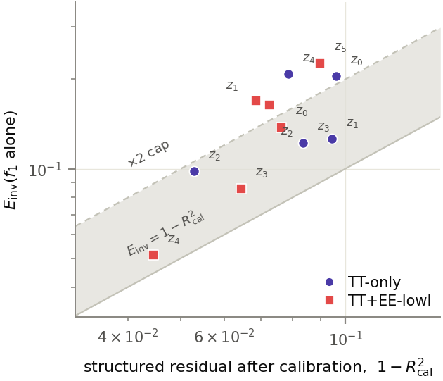

Scatter of E_inv(f₁ alone) against 1 − R²_cal for all 11 latents, with the
predicted band [1−R², 2(1−R²)] shaded. Six points sit inside the band; five
sit above its factor-2 cap, at the deliberately extreme-separation pairs the
audit draws (annotated) — the ratio E_inv/(1−R²_cal) spans [1.1, 2.6] across
all 11. Two instruments built for different purposes — an interventional
audit and a predictive calibration — agree quantitatively about what moves
inside a level set. Sources: `levelset_audit_*.json` +
`sufficiency_audit_*.json`.

#### F7.3 — distance curves and 1-D responses *(optional/appendix — not built)*

Invariance error against level-set separation (monotone rise) and the
matched-nuisance response leg with its spline fit. The distance curves are
tabulated per latent in `levelset_audit_*.md`.

---

### 8. Observable-domain triangulation: agreement where identifiable, and a structural non-identifiability

Decoder-effect templates — what moving a latent does to the spectrum,
d_k(ℓ) = ∂Decoder(z)_ℓ/∂z_k by JVP, decomposed onto data-driven parameter
templates t_j(ℓ) and compared against the symbolic sensitivities of §5.

→ *Result, positive*: the decomposition is essentially complete and the
decoder-side loadings agree with the symbolic signatures — cross-domain
confirmation of *which parameters* a latent moves, for the shape sector.
→ *Result, negative*: the (τ, lnA_s) templates are near-collinear in both
designs, so the amplitude split lies along a degenerate ridge and is not
identifiable; the frozen gate fails on both models and the ratio it produces
drifts across fit variants. **The decoder yields no fourth −2 readout.**
→ *Raises*: is a coordinate a property of its own latent, or of the code?

#### F8.1 — Decoder-effect atlas

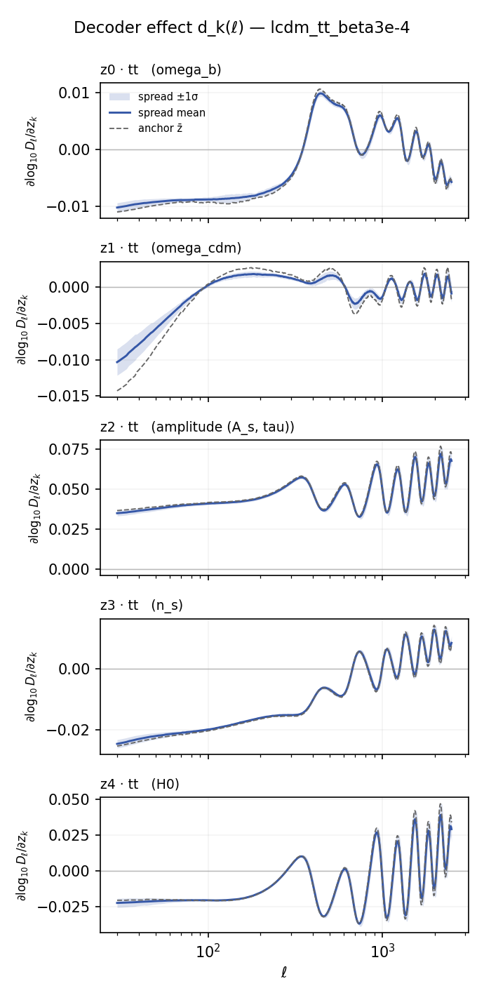

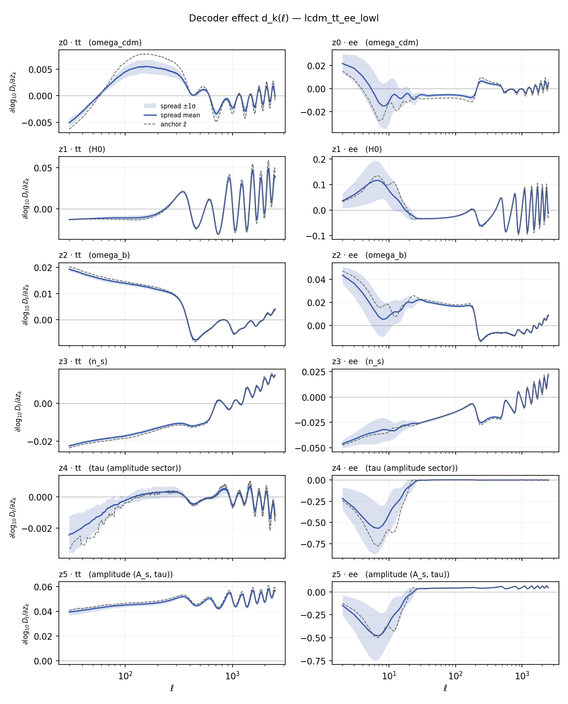

d_k(ℓ) for every latent (anchor curve plus the mean ± spread over 64 T1
posterior-mean rows) with the template reconstruction overlaid. Existing
renders from `experiments/decoder_effect_*_curves.png`; re-render for print
from the twin `_curves.npz` when the figure goes to layout.

#### F8.2 — Cross-domain agreement, honestly weighted

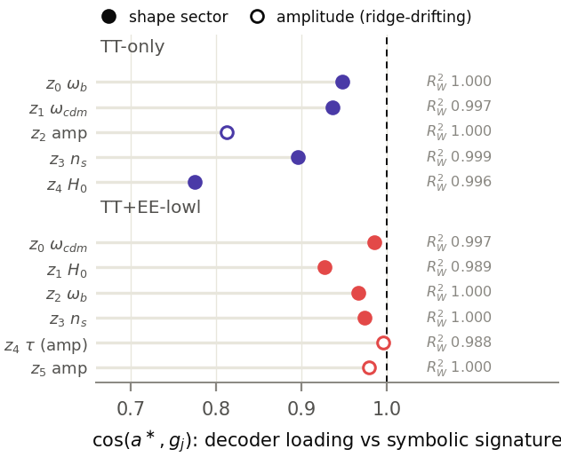

cos(a\*, g_j) per latent, 0.77–1.00: the decoder-side loading vector against
the symbolic signature of F5.4. Shape-sector points are solid; the
amplitude-latent points are hollow, because their cosines rest partly on
components that drift along the ridge of F8.3 — the honest weakening behind
"where identifiable". Source: `experiments/decoder_effect_*.json`.

#### F8.3 — The ridge: why there is no fourth readout

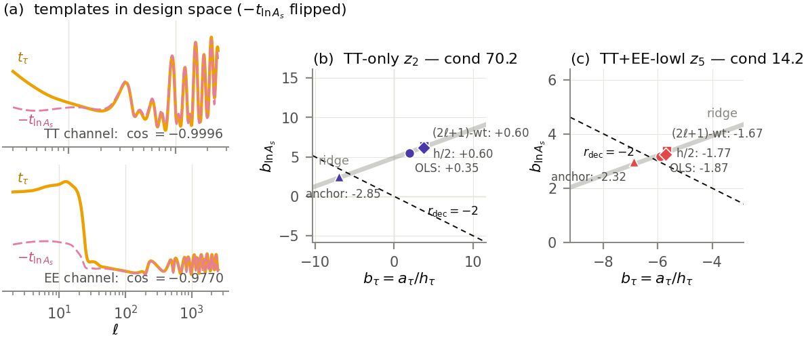

(a) t_τ(ℓ) and −t_lnAs(ℓ) overlaid after scaling, per channel: they lie on
top of each other — uncentered cos = −0.9996 (TT channel), −0.9770 (EE
channel), −0.9902 for the EE concat design, at condition numbers 70.2 and
14.2. Moving θ along (δτ, δlnA_s) ∝ (1, 2) leaves these spectra essentially
invisible. (b) and (c): the fitted amplitude split for the amplitude latent
of each checkpoint, in b = a/half units, across four fit variants
(OLS · (2ℓ+1)-weighted · h/2 templates · anchor point). Every variant lands
on the same grey ridge line at effectively no change in R²_W, while the
implied r_dec slides along it: EE −1.87 / −1.67 / −1.77 / −2.32, TT +0.35 /
+0.60 / +0.60 / −2.85. The dashed line marks where r_dec = −2 would sit. Note
the figure works in scaler-standardised design space (T_norm = T_phys/σ) —
the raw npz templates do not reproduce the documented cos values. Sources:
`data/spectral_templates_v1.npz`, `experiments/decoder_effect_*.json`.

**Gate G4b, bullet by bullet.** Three frozen bullets, and the gate FAILS on
both models. The **amplitude-sector mass** bullet requires ≥ 0.8 and returns
0.64 on TT and 0.79 on EE — a fail on both, though on EE only barely. The
**|r_dec + 2| ≤ 0.3** bullet fails outright on TT at r_dec = +0.351, and on
EE returns a nominal pass at −1.873 that we rule *unidentifiable* rather than
bank: across fit variants the same quantity spans −1.67 to −2.32, so the
nominal pass is a property of which fit was run first, not of the decoder.
The **decomposition R²_W ≥ 0.8** bullet passes comfortably on both, at 1.000
and 1.000 — the templates really do account for the decoder effect, across
all latents at R²_W 0.988–1.000. So the stage's machinery works; it is the
within-pair split that the design cannot express.

**What survives as identifiable.** The shape-sector coefficients — TT z0's
ω_b = −0.52 and z3's n_s = +0.47, EE z2's ω_b = +0.42 with n_s = −0.35, EE
z3's n_s = +0.43 — and proj_brk, the projection onto the degeneracy-breaking
direction (−2, 1)/√5, which for EE z5 is 0.047 and is stable across all four
fit variants (0.046 / 0.048 / 0.047 / 0.048). What does *not* survive:
proj_deg, r_dec and the amplitude mass, all of which the deliverables report
"for completeness, not as claims". Per-checkpoint scope, and the mechanism —
template collinearity — is a property of the *design*, not of either encoder.
Source: `experiments/decoder_effect_*.{json,md}`.

---

### 9. Degeneracy breaking splits rather than duplicates the amplitude sector

Sparse cross-validated probes for decodability from each latent, then
slab-conditional MI for redundancy versus synergy. Null: shuffled probes.

**The count fingerprint is blind and model-level.** As F2.2 already showed,
TT-only carries **one** amplitude-sector latent and TT+EE-lowl carries
**two** — z4 τ-anchored, z5 the combination — and that is visible in raw
parameter MI before any symbolic search runs. Degeneracy breaking is legible
in the code's organisation, not only in its coordinates.

**Split, not duplicated.** After SR, the EE τ-direction turns out to be
carried by z4 essentially alone: its 1-SE carrier set A\* = {z2, z4} is the
smallest in either model, and z4 decodes its own coordinate at R² 0.946. If
the two amplitude latents were redundant copies, conditioning one on the
other would destroy information; instead it *creates* it. Conditioning z1's
information about `A_s·e^{−2τ}` on z5 raises it from 0.013 to 0.473 nat —
and this is not a one-off: **no redundant pair exists in either model, and
every top-2 carrier conditional is synergistic**, with redundancy scores from
−3.99 to −34.63.

**Coordinates are latent-anchored, tails distributed.** Every canonical f₁ is
linearly decodable from its own latent at rank-normal R² 0.88–0.95, with the
own latent always inside the 1-SE carrier set — but never *only* the own
latent: axis-aligned is False for all 11, so the remainder is spread across
the code. The residual coordinates are genuinely distributed by comparison,
own-latent R² 0.01–0.58 (per-latent values in T6.1). The shuffled-probe null
sits at max R² ≈ −0.000 with shuffled-f MI floors ≈ 0.001 nat, so none of
this is probe capacity. Source: `experiments/subspace_probe_*.json`. T1
probes, T2 confirmation.

---

### 10. The symbolic latent atlas

The capstone. Under the frozen predicates, **10 of 11 latents across two
checkpoints reach "primarily interpreted", with one explicitly unresolved
case** (EE z0). The per-latent evidence has already been given: f₁ and its
recurrence in T4.1, the η ladder in F5.1 and T5.3, f₂ in T6.1, the level-set
outcomes in §7.

**The status predicates, as frozen.** *Interpreted* requires a
minimal-stable S\*, R_SR ≥ 0.8, η_S ≥ 0.95, a residual **pass**, η_post ≥ 0.95
and a level-set pass. *Primarily interpreted* relaxes exactly one thing: the
residual **fails**, structured, with f₂ documented — the rest (η_S ≥ 0.95,
R_SR ≥ 0.6, level-set pass) still holds. *Subspace/mixed* covers latents with
no 1-D account but a ≤3-latent subspace one; *unresolved* is everything else.
No latent in this study reaches "interpreted", and that is a statement about
the representation rather than about the instruments.

**What "primarily interpreted" licenses.** That the latent has a recurrent
1-D symbolic primary coordinate saturating its own variable support
(η_S ≥ 0.99 for all ten); that the coordinate is stable across search seeds
(R_SR ≥ 0.8, eight of eleven at 1.00); that holding the pair (f₁, f₂) fixed
while moving everything else leaves the latent approximately unchanged, at or
below the frozen 0.05 rule; and that the pair accounts for 0.59–0.96 of what
the latent physically stores.

**What it does not license.** That the latent is *explained* — no latent
passes the full sufficiency bar, and stage-1 and stage-2 residuals are
structured in every case. Any claim across VAE training seeds: R_model was
never run, so every statement is per-checkpoint. Any claim of axis-alignment:
the tails are distributed across the code for all 11. And for the three D-LS
latents (TT z1, z2, z4), an interventional level-set pass: there is no
nuisance direction left to test, and a missing test is not a pass.

**What "unresolved" means at EE z0.** Not that the coordinate is wrong — f₁
is recurrent at R_SR 1.00 with η_S 1.000. The blocker is localised and named:
the stage-2 account is the study's weakest (R² 0.39–0.41) and the joint level
sets sit at 0.060–0.062 against the frozen 0.05, inside the band its own
calibration predicts. The interaction-aware rerun raises R_SR to 1.00 and MI
to 0.499 without moving E_inv. Its residual simply holds more than one
coordinate's worth of structure, and a third level was not attempted.

Source: `experiments/latent_cards_*.{json,md}`.

#### F10.1 — the atlas plate *(optional — not built)*

One page, 11 mini-cards: role, f₁ typeset, mini η ladder, level-set
tick/cross, status colour. Purely presentational — all content is already in
§4–§7 and F5.1.

---

### 11. R-P4: exhaustive support at full protocol

Phase 4 screened all 63 supports with a *capacity* readout and promoted only
finalists to protocol. R-P4 closes that gap: the **complete** 63-support ×
5-seed grid at the study protocol for every latent — 3,465 cells (315 TT +
378 EE latent-support pairs × 5 seeds; 2,425 fresh runs, 1,040 reused with
verified protocol match), plus 165 sham runs, ≈ 5,800 core-h measured.

**The rules, frozen before any full-protocol result existed** (roadmap,
"Post-closure pre-registration (2026-08-13)", which also discloses the
4a-screen re-scoring as a peek carrying nothing). Two-stage and deliberately
asymmetric: **S⁺** is selected as the argmax of the budget-matched
M_S^(c≤10) over the 62 strict subsets on T0-val — a winner's-cursed
quantity by construction — and the claim is then carried entirely by a
seed-paired **T2** confirmation, which counts only if the paired mean exceeds
+1 SE. Separately, a **sham-input control**: the all-6 search rerun with a
permuted real θ column, a genuine parameter's marginal and therefore provably
zero information, with dilution declared demonstrated only if the pooled
Δ_sham is negative by more than 1 SE.

#### F11.2 — Subset advantages and the sham mechanism, crossed

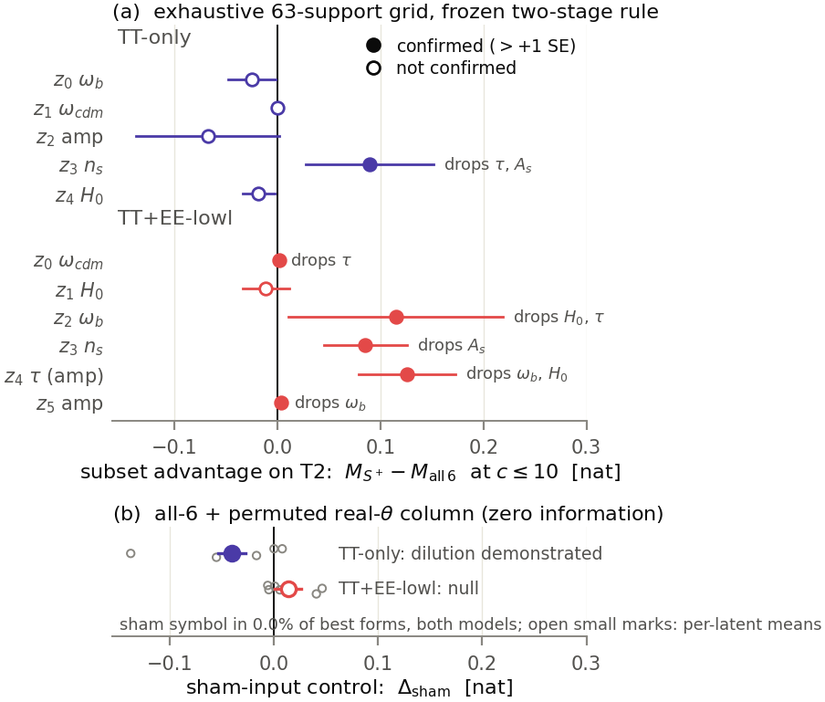

(a) Per latent, the seed-paired T2 contrast M_{S⁺} − M_{all-6} at c ≤ 10 with
±SE; filled = confirmed under the frozen rule, open = not confirmed, each
confirmed row annotated with what S⁺ drops. (b) The sham control per model,
with per-latent means as open marks. Selection on T0-val, confirmation on T2.

**Six of eleven confirm.** Substantively: TT z3 at +0.090 ± 0.062 nat
dropping {τ, A_s}; EE z2 at +0.115 ± 0.104 dropping {H₀, τ}; EE z3 at
+0.085 ± 0.040 dropping A_s; and the study's strongest case, EE z4 at
+0.126 ± 0.047 with S⁺ = {ω_cdm, τ, A_s, n_s}, where every support in the
staircase's top ten beats all-6 on validation. EE z0 and z5 also pass the
predicate but at ≤ 0.003 nat — recorded as confirmed exactly as registered,
and read as negligible. The other five are not confirmed.

**The sham mechanism test crosses the subset result, and that is the
finding.** TT's pooled Δ_sham is **−0.0404 ± 0.0134** nat (n = 75), negative
at 3.0 SE — dilution demonstrated, dominated by z0 at −0.138 ± 0.044, with
all three donor columns negative. EE's is +0.0137 ± 0.0126 (n = 90): the
wrong sign, so not demonstrated. In both models **0.0% of best-at-c ≤ 10
forms use the sham symbol**, so where degradation occurs it is pure
search-space dilution — the mutation space enlarged at fixed budget — and
never complexity spent on the sham.

So TT has the mechanism but, z3 aside, no confirmed subset advantage; EE has
five confirmations but no generic-dilution mechanism. The EE advantages
therefore cannot be generic search dilution: what helps there is removing
*specific real* inputs — A_s for z3, {ω_b, H₀} for z4, {H₀, τ} for z2 — a
distractor effect rather than a search-space-size effect, plausibly because
the search can latch onto their genuine but unhelpful correlations. This
paragraph is interpretation; the frozen verdicts are the contrasts and the
two pooled numbers.

**The three N-G2 flags, dispositioned.** All resolved, with no status flips
and no headline change. TT z0: all-6 stands (S⁺ −0.025 ± 0.023; the val
staircase is flat from |S| = 4 up, 2.36 → 2.56 nat, so the screen-era
instability was near-ties among top supports, not a wrong S\*) — and TT z0 is
simultaneously the most sham-dilutable latent, so dilution is real there
while no single-parameter drop recovers it. EE z3 and EE z4: both
dilution-affected, as above. Cards carry a new `s_star.exhaustive_full` field
and amended N-G2 notes; every pre-existing card number is unchanged.

One post-hoc mechanical fix is recorded for transparency: front entries whose
validation evaluation errored were serialized as `mi_val: null` and crashed
the blind-written consolidator; they are now mapped to nan and excluded — the
identical treatment every non-finite evaluation always received. No frozen
definition was touched. Sources: `experiments/subsets_full_*.json`,
`sham_control_*.json`.

---

## Scope note, carried on every claim

Everything above is **per-checkpoint**. Five PySR seeds establish *search*
stability (R_SR); VAE-training-seed stability (R_model, roadmap Phase 9) was
not run — it needs GPU retraining in the parent repo. Partial cross-model
evidence exists (the amplitude family recurs across two different
architectures and data regimes, with the count fingerprint matching the
physics) but is not a substitute. Phase 9 remains executable later without
touching any frozen threshold.

---

## Figure & table inventory (build notes)

**Figures embedded (13).**

| ID | File | Section |
|---|---|---|
| F2.2 | `F2_2_audit_heatmap` (KSG recompute, cached in `_cache_audit_mi.npz`) | §2 |
| F4.1 | `F4_1_envelopes` (both models + null band) | §4 |
| F5.1 | `F5_1_eta_ladder` | §5 |
| F5.2 | `F5_2_staircases` | §5 |
| F5.3 | `F5_3_residual_structure` | §5 |
| F5.4 | `F5_4_signatures` | §5 |
| F5.5 | `amplitude_scatter` (reused artifact) | §5.x |
| F5.7 | `F5_7_affine_vs_literal` | §5.x |
| F6.1 | `F6_1_stage2_gain` | §6 |
| F7.2 | `F7_2_audit_vs_calibration` | §7 |
| F8.1 | `experiments/decoder_effect_*_curves.png` (reused artifact, ×2) | §8 |
| F8.2 | `F8_2_agreement` | §8 |
| F8.3 | `F8_3_ridge` | §8 |

**Tables (5).** T2.1 (priors), T4.1 (primary coordinates, both checkpoints),
T5.3 (intrinsic ceilings), T6.1 (second coordinates, both checkpoints), and
the stage-1 residual-audit numbers under F5.3.

**Changed 2026-08-19.** F5.3 reduced to its right panel — the script now
renders that alone and saves to `F5_3_residual_structure`; the shipped PNG
was composed by cropping the previous two-panel render, because the panel
reads `models/*/analysis/residual_z5_v1.npy`, which lives on CSD3 and is not
in a local checkout. **Run `make_fig_F5_3_residual_audit.py` where those
caches exist to regenerate the vector PDF.** F6.1 reduced to its left panel
and re-rendered locally (PDF + PNG both current). `figstyle.REPO` now derives
the repo root from the script location instead of a hardcoded CSD3 path, with
`CMB_LCDM_SR_REPO` as an override, so the scripts run on either machine.

**Withdrawn from the report** (scripts and renders remain in `paper/figs/`,
and nothing cites them): F1.1 pipeline schematic, F3.1 invariance schematic
(now a prose passage in §3), F4.2 capacity dial, F5.6 ratio readout, F7.1
invariance ledger, F9.1 count fingerprint, F9.2 split-not-duplicated.

**Absorbed into prose**, so the reader meets each rule where it bites rather
than in one up-front block: the frozen rulebook (was T3.1) → §2 for tiers,
§4 for knee/clustering/recurrence, §5 for the η ladder, subset minimality and
the residual rule, §7 for the level-set rule, §8 for the G4b bullets, §10 for
the status predicates, §11 for the R-P4 predicates. Also absorbed: the
checkpoint summary (was T2.1) → §2; the three η's (was T5.1) → §5; the −2
readouts (was T5.2) → §5.x subsections; the interaction-aware verdicts (was
T6.2) → §6.x; the invariance ledger (was T7.1) → §7; the G4b ledger (was
T8.1) → §8; the carrier sets (was T9.1) → §9; the card table (was T10.1),
dropped as a replicate of T4.1/T5.3/T6.1; the status licence (was T10.2) →
§10.

**Left in the deliverables, not the report.** §11 now covers R-P4 only, so
four ledgers live solely in `experiments/` and `docs/`: the master controls
table (`docs/results_compendium.md` §7), the gates ledger (the `gates` block
of `experiments/latent_cards_*.json`), the full deviations register (the
cards' own register plus `docs/discovery_roadmap.md`), and the compute ledger
(roadmap budget table + the R-P4 outcome block). Every individual null, gate
verdict and deviation still appears in the report beside the instrument it
belongs to — that is the design principle, and dropping the collections does
not break it.

**Optional / appendix items not built (7).** F2.1, F3.2, F4.3, F6.2, F7.3,
F10.1, and the F11.1 control-margin strip. Each is noted at its section with
what it would show; nothing in the argument depends on any of them.

**Conventions.**
* Both checkpoints in every per-latent figure (TT row above, EE row below,
  or paired columns); latent order = card order everywhere.
* Nulls are drawn in-panel where a figure carries them, and quoted beside
  their instrument in prose otherwise — never deferred to a late section.
* One fixed colour per parameter across all figures; one accent per
  checkpoint; one shared 3-level status scale.
* Log axes wherever a frozen threshold is compared against nulls or MI spans
  decades.
* Per-latent numbers are the T2-confirmed card values; every figure caption
  names the tier it draws on, matching the §2 hygiene paragraph.
* Captions end with the per-checkpoint scope note wherever a claim could be
  misread as model-general.

**Sources of truth.** Consolidated `experiments/*.json` are canonical; raw
run dirs under `results/<run>/…` only for F3.2 and appendix panels;
`models/*/analysis/*.npy` + `data/theta.npy` for anything needing rows. The
`paper/figs/make_fig_*.py` scripts are the pattern to extend; new figure
scripts should live beside them, one script per figure ID.
