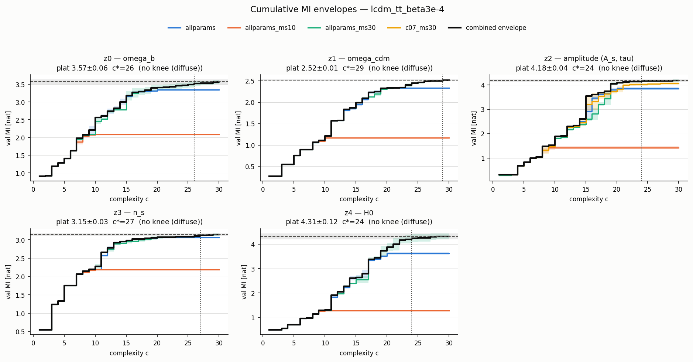

# Knee & plateau readout — `lcdm_tt_beta3e-4` (roadmap Phase 1)

Saturation readout replacing argmax-MI (docs/next_step.md section 2.1): per latent and seed the cumulative Pareto envelope M(c) = best val MI at complexity <= c, pooled as mean +/- SE across seeds within each protocol family. **Î_plat** is the across-seed mean +/- SE of the front maximum in the highest-capacity family; **c\*** is the one-SE knee, the smallest c whose combined envelope (max over family means) reaches Î_plat − SE; **MI@c<=10** keeps continuity with the sweep tables; the **eta forms** are the simplest single equations anywhere reaching eta x Î_plat. Envelope classes (c_eta = pooled crossing of eta x Î_plat, simple = c <= 10): single dominant knee (c_0.90 and c\* both <= 10), knee + slow climb (c_0.90 <= 10 < c\*), no knee/diffuse (c_0.90 > 10).

## Summary — one row per latent

| latent | audit-expected | Î_plat +/- SE (family) | c* | M(c*) | MI@c<=10 | c_0.90 | c_0.95 | c_0.99 | envelope class |
|---|---|---|---|---|---|---|---|---|---|
| z0 | omega_b | 3.570 +/- 0.059 (`allparams_ms30`, ms30, n=3) | 26 | 3.517 | 2.561 | 16 | 19 | 29 | no knee (diffuse) |
| z1 | omega_cdm | 2.515 +/- 0.013 (`allparams_ms30`, ms30, n=3) | 29 | 2.515 | 1.211 | 19 | 23 | 26 | no knee (diffuse) |
| z2 | amplitude (A_s, tau) | 4.175 +/- 0.043 (`allparams_ms30`, ms30, n=3) | 24 | 4.158 | 1.891 | 19 | 19 | 24 | no knee (diffuse) |
| z3 | n_s | 3.147 +/- 0.030 (`allparams_ms30`, ms30, n=3) | 27 | 3.127 | 2.279 | 13 | 16 | 27 | no knee (diffuse) |
| z4 | H0 | 4.313 +/- 0.120 (`allparams_ms30`, ms30, n=3) | 24 | 4.239 | 1.318 | 21 | 22 | 27 | no knee (diffuse) |

## Simplest forms at each sufficiency level

### z0 — omega_b: no knee (diffuse)

| eta | c | val MI +/- err | eta achieved | support | family/seed | form |
|---:|---:|---:|---:|---|---|---|
| c<=10 | 10 | 2.652 +/- 0.029 | 0.743 | omega_b, omega_cdm, H0, n_s | `allparams`/s1 | `exp(omega_b*log(H0)/(n_s*log(H0) - log(omega_cdm)))` |
| 0.90 | 15 | 3.447 +/- 0.033 | 0.965 | omega_b, omega_cdm, H0, A_s, n_s | `allparams_ms30`/s0 | `(n_s*omega_cdm*(omega_b*log(H0) - 0.2542249) - 0.23302917*omega_b)*log(A_s)/(omega_b*omega_cdm)` |
| 0.95 | 15 | 3.447 +/- 0.033 | 0.965 | omega_b, omega_cdm, H0, A_s, n_s | `allparams_ms30`/s0 | `(n_s*omega_cdm*(omega_b*log(H0) - 0.2542249) - 0.23302917*omega_b)*log(A_s)/(omega_b*omega_cdm)` |
| 0.99 | 19 | 3.551 +/- 0.029 | 0.995 | omega_b, omega_cdm, H0, tau, A_s, n_s | `allparams_ms30`/s0 | `log((n_s*(log(H0) - 0.25377098/omega_b) + tau**2 - 0.23355153/omega_cdm)*log(A_s))` |

### z1 — omega_cdm: no knee (diffuse)

| eta | c | val MI +/- err | eta achieved | support | family/seed | form |
|---:|---:|---:|---:|---|---|---|
| c<=10 | 10 | 1.211 +/- 0.031 | 0.481 | omega_b, omega_cdm, H0, A_s, n_s | `allparams`/s0 | `H0**2*n_s**2*omega_b/(A_s*omega_cdm**2)` |
| 0.90 | 17 | 2.295 +/- 0.034 | 0.912 | omega_b, omega_cdm, H0, tau, A_s, n_s | `allparams`/s1 | `tau - log(H0**2*omega_b*(n_s - 0.5581442)**2/(A_s*(omega_b - omega_cdm)**2))` |
| 0.95 | 23 | 2.479 +/- 0.041 | 0.986 | omega_b, omega_cdm, H0, tau, A_s, n_s | `allparams_ms30`/s1 | `n_s - 8.08921425103936*tau**2 + log(H0**2*n_s**4*omega_b/(A_s*(omega_b - 0.738375641519217*omega_cdm)**2))` |
| 0.99 | 24 | 2.491 +/- 0.040 | 0.990 | omega_b, omega_cdm, H0, tau, A_s, n_s | `allparams_ms30`/s1 | `log(n_s - 8.121810314641*tau**2 + log(H0**2*n_s**4*omega_b/(A_s*(omega_b - 0.74529732295164*omega_cdm)**2)))` |

### z2 — amplitude (A_s, tau): no knee (diffuse)

| eta | c | val MI +/- err | eta achieved | support | family/seed | form |
|---:|---:|---:|---:|---|---|---|
| c<=10 | 10 | 1.892 +/- 0.025 | 0.453 | omega_cdm, H0, tau, A_s | `hpsweep_hp_v1/c02_ni400`/s2 | `A_s*exp(-2*tau)/log(H0*omega_cdm)` |
| 0.90 | 16 | 3.828 +/- 0.036 | 0.917 | omega_b, omega_cdm, H0, tau, A_s, n_s | `hpsweep_hp_v1/c04_pop31`/s2 | `(-omega_b*(tau - 11.635643) + log(A_s*n_s/(H0*omega_cdm + 10.331155*n_s)))/(tau - 11.635643)` |
| 0.95 | 19 | 4.151 +/- 0.033 | 0.994 | omega_b, omega_cdm, H0, tau, A_s, n_s | `allparams_ms30`/s2 | `log(A_s)*log(A_s**2*n_s**2*omega_b*exp(-8.744202*tau)/(H0**2*omega_cdm**2))` |
| 0.99 | 19 | 4.151 +/- 0.033 | 0.994 | omega_b, omega_cdm, H0, tau, A_s, n_s | `allparams_ms30`/s2 | `log(A_s)*log(A_s**2*n_s**2*omega_b*exp(-8.744202*tau)/(H0**2*omega_cdm**2))` |

### z3 — n_s: no knee (diffuse)

| eta | c | val MI +/- err | eta achieved | support | family/seed | form |
|---:|---:|---:|---:|---|---|---|
| c<=10 | 10 | 2.406 +/- 0.028 | 0.765 | omega_b, omega_cdm, H0, n_s | `allparams_ms30`/s0 | `log(H0/omega_b)**2/(n_s**4*omega_cdm)` |
| 0.90 | 12 | 2.890 +/- 0.031 | 0.919 | omega_b, omega_cdm, H0, n_s | `allparams`/s4 | `omega_b - exp((-H0*n_s*(omega_cdm + 0.3774145) - 1.3512208)/H0)` |
| 0.95 | 13 | 3.005 +/- 0.035 | 0.955 | omega_b, omega_cdm, H0, n_s | `allparams`/s3 | `n_s + 2.6248958*omega_cdm - 0.014789592*omega_cdm/omega_b + 2.7794137/H0` |
| 0.99 | 25 | 3.121 +/- 0.030 | 0.992 | omega_b, omega_cdm, H0, tau, n_s | `allparams_ms30`/s2 | `(-n_s + exp(exp((H0*(0.107376830070722*tau**2 - (n_s + 17.3844639391891*omega_b)*(omega_cdm + 0.024684908)) - 1.979408)/H0)) + 0.3976355)**2` |

### z4 — H0: no knee (diffuse)

| eta | c | val MI +/- err | eta achieved | support | family/seed | form |
|---:|---:|---:|---:|---|---|---|
| c<=10 | 10 | 1.354 +/- 0.025 | 0.314 | omega_cdm, H0, tau, A_s | `allparams`/s3 | `3807.1651869729*A_s*omega_cdm*(0.0162068696706748*H0 - tau)**2` |
| 0.90 | 19 | 4.102 +/- 0.032 | 0.951 | omega_b, omega_cdm, H0, tau, A_s, n_s | `allparams_ms30`/s2 | `-n_s + omega_cdm + log(A_s*omega_cdm*(0.000346895983412822*H0**2 + 1)**2*exp(-2*tau)/omega_b) + 15.9329711651431` |
| 0.95 | 19 | 4.102 +/- 0.032 | 0.951 | omega_b, omega_cdm, H0, tau, A_s, n_s | `allparams_ms30`/s2 | `-n_s + omega_cdm + log(A_s*omega_cdm*(0.000346895983412822*H0**2 + 1)**2*exp(-2*tau)/omega_b) + 15.9329711651431` |
| 0.99 | 21 | 4.434 +/- 0.031 | 1.028 | omega_b, omega_cdm, H0, tau, A_s, n_s | `allparams_ms30`/s2 | `n_s - omega_cdm - log(8179146.41028849*A_s*omega_cdm*(0.000349660044769773*H0**2 + 1)**2*exp(-2*tau)/omega_b - omega_b)` |

---
_Generated by `scripts/knee_readout.py`; families outside the drawn four still feed the combined envelope. Re-run after `allparams_ms30` (Phase 1b) lands._
