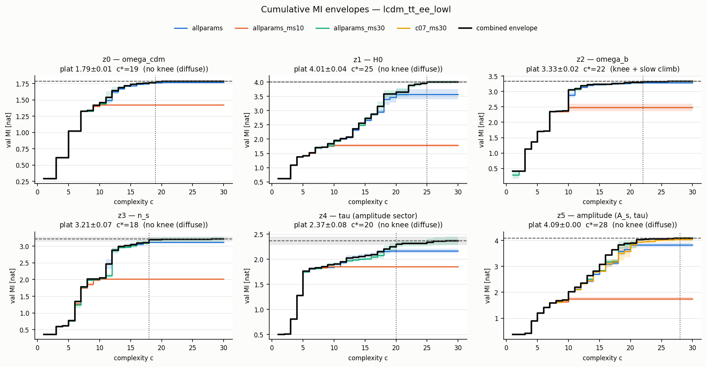

# Knee & plateau readout — `lcdm_tt_ee_lowl` (roadmap Phase 1)

Saturation readout replacing argmax-MI (docs/next_step.md section 2.1): per latent and seed the cumulative Pareto envelope M(c) = best val MI at complexity <= c, pooled as mean +/- SE across seeds within each protocol family. **Î_plat** is the across-seed mean +/- SE of the front maximum in the highest-capacity family; **c\*** is the one-SE knee, the smallest c whose combined envelope (max over family means) reaches Î_plat − SE; **MI@c<=10** keeps continuity with the sweep tables; the **eta forms** are the simplest single equations anywhere reaching eta x Î_plat. Envelope classes (c_eta = pooled crossing of eta x Î_plat, simple = c <= 10): single dominant knee (c_0.90 and c\* both <= 10), knee + slow climb (c_0.90 <= 10 < c\*), no knee/diffuse (c_0.90 > 10).

## Summary — one row per latent

| latent | audit-expected | Î_plat +/- SE (family) | c* | M(c*) | MI@c<=10 | c_0.90 | c_0.95 | c_0.99 | envelope class |
|---|---|---|---|---|---|---|---|---|---|
| z0 | omega_cdm | 1.788 +/- 0.008 (`allparams_ms30`, ms30, n=3) | 19 | 1.781 | 1.457 | 12 | 14 | 19 | no knee (diffuse) |
| z1 | H0 | 4.006 +/- 0.045 (`allparams_ms30`, ms30, n=3) | 25 | 3.998 | 1.952 | 20 | 22 | 25 | no knee (diffuse) |
| z2 | omega_b | 3.330 +/- 0.020 (`allparams_ms30`, ms30, n=3) | 22 | 3.313 | 3.057 | 10 | 12 | 22 | knee + slow climb |
| z3 | n_s | 3.212 +/- 0.071 (`allparams_ms30`, ms30, n=3) | 18 | 3.186 | 2.048 | 13 | 16 | 18 | no knee (diffuse) |
| z4 | tau (amplitude sector) | 2.370 +/- 0.082 (`allparams_ms30`, ms30, n=3) | 20 | 2.299 | 1.905 | 17 | 20 | 26 | no knee (diffuse) |
| z5 | amplitude (A_s, tau) | 4.087 +/- 0.004 (`allparams_ms30`, ms30, n=3) | 28 | 4.086 | 2.019 | 18 | 20 | 23 | no knee (diffuse) |

## Simplest forms at each sufficiency level

### z0 — omega_cdm: no knee (diffuse)

| eta | c | val MI +/- err | eta achieved | support | family/seed | form |
|---:|---:|---:|---:|---|---|---|
| c<=10 | 10 | 1.457 +/- 0.030 | 0.815 | omega_b, omega_cdm, H0, A_s, n_s | `allparams`/s0 | `omega_cdm/(n_s*omega_b*(H0 - log(A_s)))` |
| 0.90 | 11 | 1.719 +/- 0.036 | 0.962 | omega_b, omega_cdm, H0, A_s, n_s | `allparams_ms30`/s0 | `(n_s*omega_b*log(A_s) + omega_cdm)*log(H0)/(n_s*omega_b)` |
| 0.95 | 11 | 1.719 +/- 0.036 | 0.962 | omega_b, omega_cdm, H0, A_s, n_s | `allparams_ms30`/s0 | `(n_s*omega_b*log(A_s) + omega_cdm)*log(H0)/(n_s*omega_b)` |
| 0.99 | 16 | 1.787 +/- 0.034 | 0.999 | omega_b, omega_cdm, H0, A_s, n_s | `allparams`/s0 | `omega_b*(H0 + 27.826664)*(n_s - 0.095620185)*log(A_s)**4/omega_cdm` |

### z1 — H0: no knee (diffuse)

| eta | c | val MI +/- err | eta achieved | support | family/seed | form |
|---:|---:|---:|---:|---|---|---|
| c<=10 | 10 | 2.001 +/- 0.022 | 0.500 | omega_b, omega_cdm, H0, tau | `allparams`/s2 | `H0*(omega_cdm + 0.09269125)*(tau + log(omega_b))` |
| 0.90 | 18 | 3.797 +/- 0.035 | 0.948 | omega_b, omega_cdm, H0, tau, A_s, n_s | `allparams_ms30`/s1 | `n_s + log(omega_b**2*exp(2*tau)/(A_s*omega_cdm**4*(0.00140754472121465*H0**2 + 1)**4)) - 26.2636336997827` |
| 0.95 | 20 | 3.809 +/- 0.036 | 0.951 | omega_b, omega_cdm, H0, tau, A_s, n_s | `allparams`/s0 | `log(-log(n_s) + log(A_s*omega_cdm**4*(0.00141385081781373*H0**2 + 1)**4*exp(-2*tau)/omega_b**2) + 26.2457528829658)` |
| 0.99 | 22 | 4.036 +/- 0.028 | 1.007 | omega_b, omega_cdm, H0, tau, A_s, n_s | `allparams_ms30`/s2 | `(n_s*(omega_b + 0.16901731)*log(A_s) - (tau - 9.714995)*(log(H0) + log(H0*omega_cdm - 1.7307256)))/((omega_b + 0.16901731)*log(A_s))` |

### z2 — omega_b: knee + slow climb

| eta | c | val MI +/- err | eta achieved | support | family/seed | form |
|---:|---:|---:|---:|---|---|---|
| c<=10 | 10 | 3.106 +/- 0.030 | 0.933 | omega_b, omega_cdm, A_s, n_s | `allparams_ms30`/s1 | `omega_b + 0.00186799373923218*(n_s - omega_cdm)*log(A_s)` |
| 0.90 | 10 | 3.106 +/- 0.030 | 0.933 | omega_b, omega_cdm, A_s, n_s | `allparams_ms30`/s1 | `omega_b + 0.00186799373923218*(n_s - omega_cdm)*log(A_s)` |
| 0.95 | 12 | 3.240 +/- 0.035 | 0.973 | omega_b, omega_cdm, A_s, n_s | `allparams_ms30`/s0 | `-(n_s - omega_cdm*(30.4234703687568*omega_b + 0.425274602243548))*log(A_s)/(30.4234703687568*omega_b + 0.425274602243548)` |
| 0.99 | 17 | 3.343 +/- 0.035 | 1.004 | omega_b, omega_cdm, H0, A_s, n_s | `allparams`/s4 | `H0*((n_s - 1.0812154*omega_cdm)*log(A_s) + 61.77855)/(H0*log(omega_b) + 0.912889)` |

### z3 — n_s: no knee (diffuse)

| eta | c | val MI +/- err | eta achieved | support | family/seed | form |
|---:|---:|---:|---:|---|---|---|
| c<=10 | 10 | 2.112 +/- 0.029 | 0.658 | omega_b, omega_cdm, H0, n_s | `allparams`/s2 | `log(H0)/(n_s**4*omega_b*omega_cdm)` |
| 0.90 | 12 | 3.042 +/- 0.031 | 0.947 | omega_b, omega_cdm, H0, n_s | `allparams`/s0 | `(2.085951*H0 - 8.005233)*log(omega_b)/(H0*n_s + omega_cdm*(2.085951*H0 - 8.005233))` |
| 0.95 | 14 | 3.193 +/- 0.038 | 0.994 | omega_b, omega_cdm, H0, n_s | `allparams`/s0 | `log(omega_cdm*(omega_b - 0.0059834956)*exp(4.407752*n_s)/log(H0))` |
| 0.99 | 14 | 3.193 +/- 0.038 | 0.994 | omega_b, omega_cdm, H0, n_s | `allparams`/s0 | `log(omega_cdm*(omega_b - 0.0059834956)*exp(4.407752*n_s)/log(H0))` |

### z4 — tau (amplitude sector): no knee (diffuse)

| eta | c | val MI +/- err | eta achieved | support | family/seed | form |
|---:|---:|---:|---:|---|---|---|
| c<=10 | 9 | 1.958 +/- 0.037 | 0.826 | tau, A_s | `allparams_ms30`/s0 | `A_s/(log(-log(tau - 0.009551904)) + 1.83968563874838)` |
| 0.90 | 12 | 2.142 +/- 0.032 | 0.904 | tau, A_s | `allparams`/s0 | `2.60065518143209*A_s*(0.620095548042616*log(log(0.24915862/tau)) - 1)**2/tau` |
| 0.95 | 18 | 2.346 +/- 0.033 | 0.990 | omega_b, tau, A_s | `allparams_ms30`/s2 | `A_s/log(-log(A_s) - 0.30608752/(omega_b - tau + 0.13350567) + 0.34416914/tau)` |
| 0.99 | 18 | 2.346 +/- 0.033 | 0.990 | omega_b, tau, A_s | `allparams_ms30`/s2 | `A_s/log(-log(A_s) - 0.30608752/(omega_b - tau + 0.13350567) + 0.34416914/tau)` |

### z5 — amplitude (A_s, tau): no knee (diffuse)

| eta | c | val MI +/- err | eta achieved | support | family/seed | form |
|---:|---:|---:|---:|---|---|---|
| c<=10 | 10 | 2.019 +/- 0.028 | 0.494 | omega_cdm, H0, tau, A_s | `allparams`/s0 | `A_s*exp(-2*omega_cdm - 2*tau)/log(H0)` |
| 0.90 | 17 | 3.688 +/- 0.028 | 0.902 | omega_b, omega_cdm, H0, tau, A_s, n_s | `hpsweep_hp_v1/c02_ni400`/s2 | `(n_s*omega_b - (0.26833662*n_s + omega_cdm)*(exp(tau) - 0.47809264))*log(H0)/(A_s*n_s)` |
| 0.95 | 18 | 3.976 +/- 0.036 | 0.973 | omega_b, omega_cdm, H0, tau, A_s, n_s | `hpsweep_hp_v1/c08_ps54`/s1 | `A_s*exp(-2*tau - 0.0026960534/omega_b - 2.8380374*omega_cdm/n_s)/log(H0)` |
| 0.99 | 21 | 4.047 +/- 0.031 | 0.990 | omega_b, omega_cdm, H0, tau, A_s, n_s | `allparams_ms30`/s2 | `log(exp((2*n_s*(tau - exp(exp(omega_b))) + 2.83805233323094*omega_cdm + 0.0344755670939411)/n_s)*log(H0)/A_s)` |

---
_Generated by `scripts/knee_readout.py`; families outside the drawn four still feed the combined envelope. Re-run after `allparams_ms30` (Phase 1b) lands._
