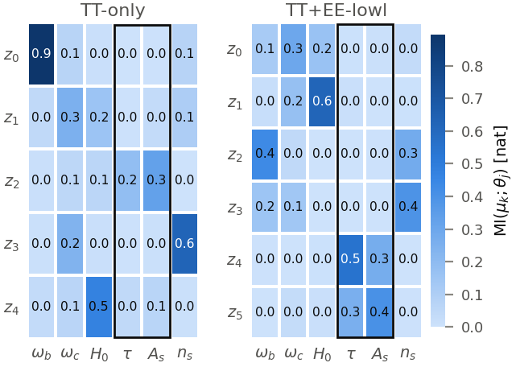
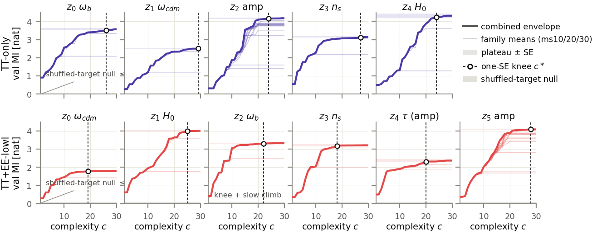
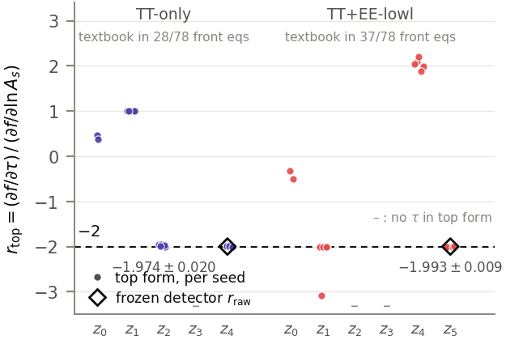
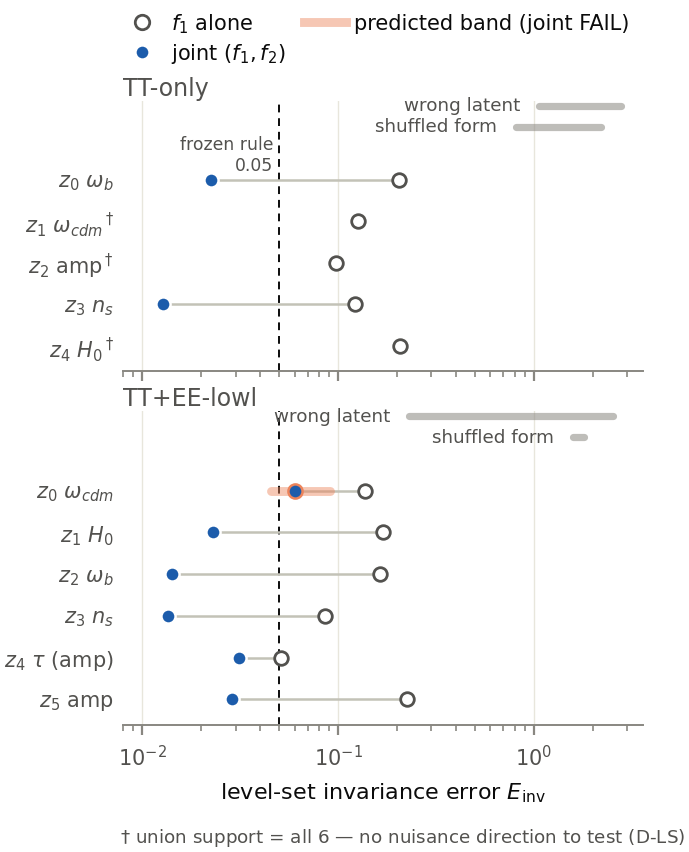
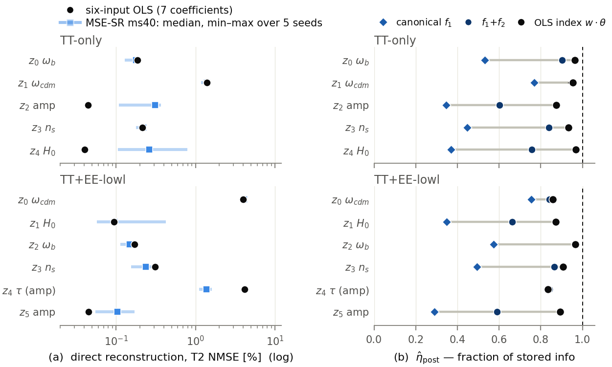
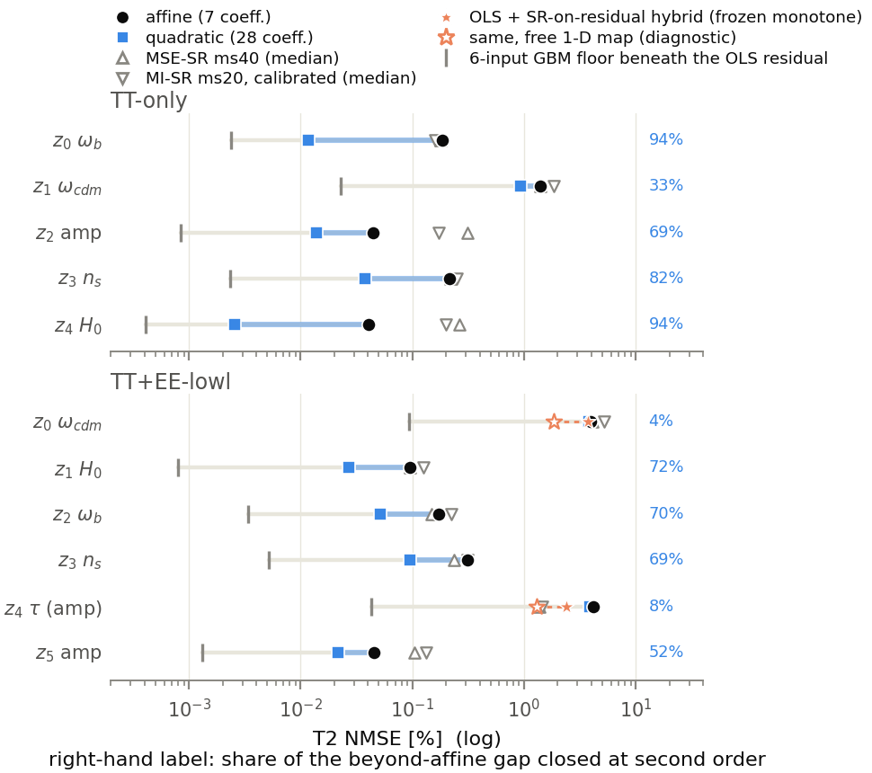
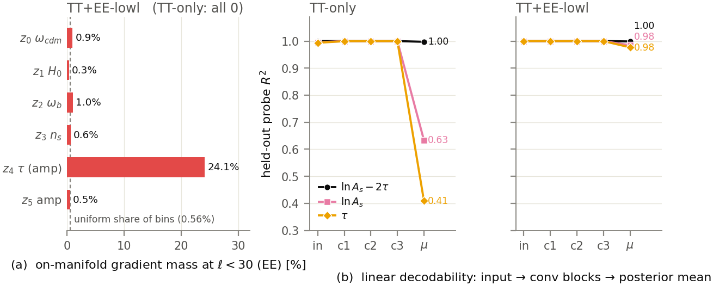

# Can the latents of a CMB autoencoder be read as physics? — conclusive report

*Written 2026-09-04 for a reader who has not followed the project. It is the
write-up of record; the earlier `docs/archive/report_stage1.md` covered only the first of the
four stages below and is superseded. Every number traces to an artifact in
the repository; the detailed evidence is in
`docs/evidence_record.md` (the record) and
`docs/sr_objective_discussion_2026-09-02.md` (the discussion). Figure
identifiers F1–F11 are the earlier programme's; F12–F14 were built for this
report. Terms are defined where they first appear and collected in the
glossary (§8).*

---

## 0. The study in one page

**The question.** Machine-learned compressors are increasingly placed between
cosmological theory and data analysis. A β-VAE (a variational autoencoder, a
neural network that squeezes each input down to a handful of numbers and
reconstructs it from them, with a knob β that pushes those numbers toward
being independent) trained on cosmic microwave background (CMB) power
spectra ends up with five or six internal numbers per spectrum, its
**latents**. Earlier work showed these latents line up with physical
parameters. This study asked a stricter question: **starting from the six
cosmological parameters alone, can a blind search recover the formula each
latent computes, and can we prove the formula is right?** "Blind" means the
search is never told the answer, and every pass/fail rule was fixed before
the results were seen.

**The one piece of physics you need.** A CMB power spectrum records how much
the sky fluctuates at each angular scale, indexed by the multipole $\ell$
(large $\ell$ is small scale). Two of the six parameters, the primordial
amplitude $A_s$ and the reionization optical depth $\tau$, are famously
degenerate: at all but the largest scales the spectrum depends on them only
through the product $A_s e^{-2\tau}$, so raising $A_s$ and raising $\tau$
together leaves it unchanged. The one place this breaks is large-scale
polarization, the "reionization bump" at $\ell < 30$ in the EE spectrum.
This gives a probe with a known answer. A network that sees only temperature
(TT) above $\ell = 30$ can only ever learn the product; a network that also
sees low-$\ell$ polarization could learn $A_s$ and $\tau$ separately. A
blind method that recovers the exponent $-2$ without being told about it has
passed a real test.

**What was found, in short.** The blind search recovered a formula for every
latent, found the $-2$ five independent ways, and showed that adding
polarization splits the amplitude information across two latents instead of
copying it. Under rules fixed in advance, ten of the eleven latents earned
the status "primarily interpreted". Then a control that had been registered
before the results were known — a plain linear fit, one weight per parameter
— matched or beat the discovered formulas for most latents, on
reconstruction and on information alike. That did not make the earlier
measurements wrong; it changed what they license. The latents are, to about
99.8% of their variance, weighted sums of the six parameters, because in the
log-spectrum basis the leading physics *is* additive. What lies beyond the
sum is real and deterministic; an exact quadratic fit closes most of it for
nine latents, and the search proved its worth on the remaining two, where it
found a pole in $\tau$ and a rational curvature that no polynomial expresses.
Finally, gradients through the encoder show exactly where the
degeneracy-breaking information enters: one latent alone reads the
reionization window, and the TT network discards the amplitude split at its
final compression step, not earlier.

**How the report is organised.** §1 sets up the networks and the method.
Stages 1–4 (§2–§5) follow the order in which the work was done: discovery
and validation (§2); the linear baseline that reset the interpretation (§3);
the search for structure beyond the linear fit (§4); attribution inside the
encoder (§5). §6 lists what stands and what the symbolic search was actually
good for, §7 the limits, §8 a glossary, §9 the artifacts.

---

## 1. Setup: the networks, the inputs, and the method

### 1.1 The two networks

Both compressors are stored checkpoints from the parent reproduction of
Piras, Herold, Lucie-Smith & Komatsu (2025). They were trained on the same
500,000 spectra computed by the CLASS Boltzmann code for parameter settings
drawn from a space-filling random design (a Latin hypercube) over the six
parameters of §1.2. Spectra are handled as $\log_{10}$ of the power at each
$\ell$, relative to a reference spectrum and standardised per $\ell$.

* **TT**: one encoder, **5 latents**, sees the temperature spectrum over
  $\ell \in [30, 2500]$.
* **TT+EE-lowl**: two encoders, **6 latents**, sees the temperature spectrum
  and the EE polarization spectrum over $\ell \in [2, 2500]$, including the
  reionization bump.

For each latent $k$ the encoder outputs a mean $\mu_k(\theta)$ and a spread
$\sigma_k(\theta)$; the network samples $Z_k = \mu_k + \sigma_k\varepsilon$
with $\varepsilon$ standard normal. The object interpreted throughout is the
mean $\mu_k(\theta)$, a deterministic function of the six parameters
$\theta$, evaluated on the 50,000 spectra of the held-out test set. The noisy
version $Z_k$ is used once, to measure how much information a latent
physically transmits (§2.4).

### 1.2 The six parameters

| parameter | symbol | range sampled |
|---|---|---|
| baryon density | $\omega_b$ | [0.020, 0.024] |
| cold-dark-matter density | $\omega_{\mathrm{cdm}}$ | [0.100, 0.130] |
| Hubble constant | $H_0$ | [62, 80] |
| reionization optical depth | $\tau$ | [0.01, 0.13] |
| primordial amplitude (log) | $\ln 10^{10}A_s$ | [2.90, 3.18] |
| primordial tilt | $n_s$ | [0.92, 1.01] |

Two groups recur below: the **amplitude sector** $(\tau, A_s)$ and the
**shape sector** $\{\omega_b, \omega_{\mathrm{cdm}}, H_0, n_s\}$, which sets
the positions and relative heights of the acoustic peaks. The ranges are
narrow (the shape parameters vary by ±9–13%), which matters in §3.

The search receives the six raw parameters and nothing else; in particular
the combination $A_s e^{-2\tau}$ is never computed anywhere in the pipeline.
One convention: the amplitude is *sampled* as $\ln 10^{10}A_s$ but handed to
the search in linear scale as $A_s$, so discovered formulas print $A_s$;
the linear fits of §3 use the sampled log form.

### 1.3 Blind symbolic regression, and why mutual information

**Symbolic regression** (SR) searches over formulas built from the inputs,
constants and a fixed operator set (here $+,-,\times,\div,\exp,\log$,
square), evolving a population of candidate expressions and keeping, for
each formula **size** (the number of nodes in its expression tree, called
its *complexity*), the best one found. The engine is PySR. Each search is
repeated with **five random seeds**; a result that only one seed finds is
treated with suspicion, and the fraction of seeds that agree is reported as
the **recurrence** $R_{\mathrm{SR}}$.

The unusual choice is the score. Formulas are ranked not by fit error but by
**mutual information** (MI) with the latent: how many nats of information
the formula's value carries about the latent's value, whatever the
functional relation between them. MI is unchanged by any invertible
transformation of either variable, so a formula and its logarithm, or its
square, score the same. Two consequences follow. The search is rewarded for
finding the right *dependence* on the parameters, never for matching the
latent's units or scale. And the answer is a **family** of equivalent
formulas rather than a single one, so the study reports a canonical
representative of each family and reads physical quantities off things that
are the same across the family, above all *ratios of partial derivatives*.

### 1.4 Rules fixed in advance, controls, and the three row sets

Every decision threshold used below was frozen before any shape-sector
latent was examined, and the instruments were validated first on the
amplitude sector, whose answer is known (the positive control). Every
instrument ships with a **null**: the same procedure applied to a target
with no structure (for a search, a randomly permuted latent), so the reader
can see what the method reports when there is nothing to find.

The 50,000 test rows are split into three sets that never mix:

* **search rows** (the first 5,000; 4,000 to fit, 1,000 to validate);
* **calibration rows** (the next 20,000), used to fit every calibration,
  audit and anchor set after the search;
* **confirmation rows** (the last 25,000), opened once to compute the
  reported numbers.

A threshold crossing recomputed on the rows an instrument was tuned on would
not be a test; the separation is what makes the frozen rules falsifiable.
Unless a caption says otherwise, numbers below are from the confirmation
rows.

### 1.5 How to read the numbers

* **NMSE** (normalised mean squared error) is the fraction of a latent's
  variance that a fit leaves unexplained, quoted in percent; 0 is perfect.
* **MI** is in nats. Real signals here are 1–4 nat; the nulls are below
  0.07 nat.
* **Fractions of a ceiling**, written $\eta$, compare a formula's MI with
  some maximum; 1 means the formula reaches the ceiling.
* "**Seeds**" are independent restarts of the same search.
* A **calibration** is a fitted one-dimensional monotone map that converts a
  formula's output into the latent's units, needed because MI does not fix
  units; it is always fitted on the calibration rows with cross-validation.

---

## 2. Stage 1 — Discovery and validation under fixed rules

**The question.** Does each latent have a recoverable formula, does that
formula account for the latent, and does the network find the known
physics?

**What was done.** Blind SR with all six inputs on every latent (about 143
searches over three size limits); a sweep of the search's own settings (72
searches); a validation programme in ten phases (about 2,000 searches,
including a screen of all 63 non-empty subsets of the six inputs); a second
search on what each formula left behind, then repeated with the first
formula's prediction exposed as an extra input (61 searches); and an
exhaustive rerun of the 63-subset screen at full protocol with a sham-input
control (3,465 cells plus 165 sham runs, about 5,800 core-hours).

### 2.1 The roles are visible before any search

**F2.2.** Mutual information between each latent's mean and each raw
parameter, in nats (darker is more), for both networks. Read along a row to
see what a latent responds to. Each latent has a dominant parameter, its
**role**, which is fixed here and used as the expectation for everything
downstream. The boxed columns are the amplitude pair: in TT **one** latent
($z_2$) responds to it, in TT+EE-lowl **two** do, $z_4$ anchored to $\tau$
and $z_5$ to the combination. §2.6 returns to this.

### 2.2 Every latent has a recurring formula, but the sectors do not separate

**F4.1.** For each latent, the MI of the best formula found as a function of
the formula's size limit (heavy line; the faint lines are the three
size-limit families it pools). The dashed vertical line marks where more
size stops adding information within one standard error. The grey band at
the bottom of each row is the null: the same search on a randomly permuted
latent reaches at most 0.06 nat, against real values of 1.8–4.3 nat. Search
rows.

Every latent yields a formula that recurs across seeds. Two things about the
formulas were not what the study hoped for. First, the hope that shape
latents would be free of $(A_s,\tau)$ and amplitude latents free of the
shape parameters did **not** materialise at the level of *which inputs
appear*: every latent's best formulas use at least five of the six
parameters, and the TT $H_0$ latent's formula,
$A_s H_0^2\omega_{\mathrm{cdm}}e^{-2\tau}$, carries the amplitude
combination inside it. Second, the information keeps growing with formula
size for every latent instead of saturating at a small formula. Separation
did hold at the level of the *leading direction*: five independent
instruments (the raw MI of F2.2, the search's sensitivity signatures, the
first inputs a fit-error search recruits, the decoder analysis of §2.5, and
the dominant weights of the linear fit of §3) agree on which parameter
dominates each latent, all eleven times.

### 2.3 The physics check: the exponent −2, recovered blind

**F5.5.** The amplitude latent of each network plotted against the textbook
combination $\ln(A_s e^{-2\tau})$. The tight, monotone curve is the result.
The combination is computed here only to draw the plot; the search never saw
it.

**F5.6.** A quantity that is the same for every member of a formula family:
the ratio of the formula's sensitivity to $\tau$ and to $\ln A_s$, evaluated
at the centre of the parameter box. One dot per seed's best formula. Wherever
a formula contains the amplitude combination the dots sit at $-2$: the TT
amplitude latent $z_2$, the TT $H_0$ latent $z_4$, and the EE latents $z_1$
and $z_5$. Other latents need not be at $-2$. Diamonds mark the value of a
frozen detector that scans every parameter pair for a constant ratio without
being told which pair to look at.

| # | readout | how it was obtained | value |
|---|---|---|---|
| 1 | the discovered formulas themselves | blind search | the EE amplitude latent's formula is literally $A_s e^{-2\tau}$, found by every seed; the TT search returns the linearised form $A_s(\tau - c)$ with $c$ within 1.5–5% of the value a first-order expansion predicts |
| 2 | derivative ratio over all best formulas | six-input search, every seed and every setting of the sweep | $-1.974 \pm 0.018$ (TT), $-1.993 \pm 0.008$ (EE) |
| 3 | constant-ratio detector | frozen scan over all parameter pairs, not told which pair to test | the $(\tau, \ln A_s)$ pair emerges with ratio $-2.0000$ |
| 4 | an unplanned reappearance | the second-stage formula of the EE $H_0$ latent, found twice by independent searches | $A_s e^{-2\tau}/\omega_b^2$, ratio $-2.0000$ |
| 5 | the weights of a plain linear fit (§3) | least squares with $\tau$ and $\ln A_s$ as separate inputs | weight ratio $-1.979$ (TT), $-1.997$ (EE) |
| — | the decoder side | decomposing the decoder's response onto parameter templates | **no readout**; see §2.5 |

The two networks are the two regimes: in TT the degeneracy is present and
the network is forced into the combination; in TT+EE-lowl it is broken, the
network could separate $A_s$ and $\tau$, and its amplitude latent still
organises around the combination.

### 2.4 Each formula uses its inputs fully, yet misses much of the latent

"Accounts for the latent" needs a definition. Three ratios were used, each
a formula's MI divided by a ceiling:

* $\eta_S$: divided by the best MI any formula restricted to the **same
  input variables** achieved in the exhaustive 63-subset campaign. Does the
  formula extract everything its own variables offer?
* $\eta_{\mathrm{plat}}$: divided by the best MI achieved with **all six
  inputs** at the largest size. What fraction of the searchable map is it?
* $\hat\eta_{\mathrm{post}}$: divided by the information the latent
  **physically transmits**, measured from its noisy version $Z_k$. What
  fraction of what the latent stores does the formula carry?

**F5.1.** The three ratios per latent. The light circles ($\eta_S$) sit on
the dashed line at 1 for every latent: each formula exhausts its own inputs.
The dark diamonds ($\hat\eta_{\mathrm{post}}$) sit well below 1: each
formula carries only 29–84% of what its latent stores. That gap is the
result. The positive control passes: the amplitude pair is rediscovered
among the 63 subsets with no special treatment and saturates its ceiling.

The remainder was then tested directly. After a calibration that maps each
formula onto its latent (explaining 90–96% of the variance), the leftover is
still predictable from the six parameters at $R^2$ of 0.96–0.99, against
nulls of about ±0.002. The frozen rule required $R^2 \le 0.05$, so the
**residual audit fails for all eleven latents**, and that is the informative
outcome: the amplitude latents have signal-to-noise of several thousand, so
their leftover is stored information, not noise.

**F6.1.** A second blind search was run on the leftover of each first
formula, giving a second formula $f_2$ per latent. The segments show the
fraction of stored information carried by the first formula alone (diamond)
and by the two together (dot). Every latent gains; none reaches 1; and the
leftover after two formulas is again structured. Re-running the second
search with the first formula's prediction available as a seventh input
returns the same second formula for 8 of 11 latents and confirms, for the TT
amplitude latent, that its amplitude and shape information combine
multiplicatively, which an additive two-formula account cannot absorb. The
hierarchy of formulas does not terminate.

### 2.5 The intervention test, and why the decoder gives no reading

Association is not the same as being the latent's coordinate. The defining
test is an intervention: hold the formula's value fixed, move every other
parameter direction as far as possible, and measure how much the latent
moves. Pairs of parameter settings with equal formula value are drawn; the
**invariance error** is the mean squared latent difference within pairs,
scaled so that randomly matched pairs score 1. The frozen rule requires
$\le 0.05$.

**F7.1.** Invariance error on a log axis. The first formula alone (open
circles) fails the rule for every latent, at 0.05–0.23. Holding the pair
$(f_1, f_2)$ fixed (filled dots) brings the error down by about an order of
magnitude and passes for 7 of the 8 latents where the test can be run. The
one failure is EE $z_0$ (0.060 ± 0.002, inside the band its own calibration
predicts). For three TT latents (†) the two formulas between them use all
six parameters, leaving nothing to vary; those are recorded as untestable,
not as passes. The nulls sit far away: shuffled formulas and formulas
transferred to the wrong latent score 0.2–2.8.

The observable domain was tried as well. Differentiating the decoder gives
each latent's effect on the spectrum, and decomposing that effect onto the
spectrum's response to each parameter reproduces it almost perfectly and
agrees with the encoder-side signatures on which parameters each latent
moves. But the responses to $\tau$ and to $\ln A_s$ are almost exactly
antiparallel curves (cosine −0.9996 in TT), so the split between them is
not identifiable: the fitted ratio slides along a ridge from −1.67 to −2.32
(EE) and from +0.60 to −2.85 (TT) depending on fitting choices. The decoder
therefore gives **no** independent reading of the $-2$. This is not a bug; it
is the degeneracy of §0 seen from the other side, and it will return in §5.

### 2.6 Adding polarization splits the amplitude information rather than copying it

Two latents respond to the amplitude pair in TT+EE-lowl, one in TT (F2.2).
The two are not copies. If they were, knowing one would make the other
uninformative; instead, conditioning on $z_5$ *raises* the information $z_1$
holds about the combination from 0.013 to 0.473 nat, and no pair of latents
in either network is redundant. Every first formula can be decoded linearly
from its own latent (rank-correlation $R^2$ 0.88–0.95) but never from that
latent alone, and the second formulas are spread across the latent space.
None of this depends on the symbolic search.

### 2.7 The atlas as frozen, and two warning signs

| network | $z$ | role | first formula $f_1$ | size | seeds agreeing | $\eta_S$ | stored-info fraction, $f_1$ | second formula $f_2$ | stored-info fraction, $f_1{+}f_2$ | invariance error, pair | status |
|---|---|---|---|---:|---:|---:|---:|---|---:|---:|---|
| TT | 0 | $\omega_b$ | $n_s/\omega_b$ | 3 | 5/5 | 1.00 | 0.53 | $n_s(H_0 + 1325\,\omega_{\mathrm{cdm}})$ | 0.90 | 0.022 | primarily interpreted |
| TT | 1 | $\omega_{\mathrm{cdm}}$ | $H_0^2 n_s^2\omega_b/(A_s\omega_{\mathrm{cdm}}^2)$ | 10 | 4/5 | 1.00 | 0.77 | $n_s/\ln(-H_0/(\tau - 0.447)) + \omega_b$ | 0.96 | n/a† | primarily interpreted |
| TT | 2 | amplitude | $A_s/\ln(H_0(\omega_{\mathrm{cdm}} + \tau))$ | 8 | 5/5 | 1.00 | 0.35 | $n_s^2\omega_b\tau/(\omega_{\mathrm{cdm}}\tau + 3.1{\times}10^{-4})$ | 0.60 | n/a† | primarily interpreted |
| TT | 3 | $n_s$ | $n_s + \omega_{\mathrm{cdm}}$ | 3 | 5/5 | 1.00 | 0.45 | $H_0/(\omega_b^2\omega_{\mathrm{cdm}}^2)$ | 0.84 | 0.013 | primarily interpreted |
| TT | 4 | $H_0$ | $A_s H_0^2\omega_{\mathrm{cdm}}e^{-2\tau}$ | 9 | 4/5 | 1.00 | 0.37 | $\ln(H_0)/(n_s\omega_b)$ | 0.76 | n/a† | primarily interpreted |
| EE | 0 | $\omega_{\mathrm{cdm}}$ | $\omega_{\mathrm{cdm}}/(H_0 n_s\omega_b)$ | 7 | 5/5 | 1.00 | 0.76 | $A_s H_0\omega_{\mathrm{cdm}}/n_s$ | 0.84 | **0.060** | **unresolved** |
| EE | 1 | $H_0$ | $H_0^2\omega_{\mathrm{cdm}}$ | 4 | 5/5 | 1.00 | 0.35 | $A_s e^{-2\tau}/\omega_b^2$ | 0.66 | 0.023 | primarily interpreted |
| EE | 2 | $\omega_b$ | $\omega_b/n_s^2$ | 4 | 5/5 | 1.00 | 0.57 | $n_s(A_s + 1.04{\times}10^{-5}\omega_b\omega_{\mathrm{cdm}}^2)$ | 0.96 | 0.014 | primarily interpreted |
| EE | 3 | $n_s$ | $\ln(\omega_b)/(n_s + \omega_{\mathrm{cdm}})$ | 6 | 4/5 | 0.99 | 0.49 | $H_0/\omega_{\mathrm{cdm}}^2$ | 0.86 | 0.014 | primarily interpreted |
| EE | 4 | $\tau$ | $-A_s/(\tau - 0.445)$ | 5 | 5/5 | 1.07 | 0.84 | $\tau$ | 0.84 | 0.031 | primarily interpreted |
| EE | 5 | amplitude | $A_s e^{-2\tau}$ | 5 | 5/5 | 1.00 | 0.29 | $H_0\omega_{\mathrm{cdm}}/n_s$ | 0.59 | 0.029 | primarily interpreted |

**Table 2.7.** One row per latent (source: `experiments/latent_cards_*.json`).
*Size* is the number of nodes in the formula. *Seeds agreeing* is how many of
the five search seeds returned a formula equivalent to $f_1$. $\eta_S$ is
the own-inputs ceiling fraction of §2.4 (EE $z_4$'s 1.07 reflects noise in
the ceiling estimate, not a real excess). The two *stored-info fractions*
are $\hat\eta_{\mathrm{post}}$ for the first formula and for both. The
*invariance error* is the intervention test of §2.5 for the pair; † means
the pair uses all six parameters and the test cannot be run. **"Primarily
interpreted"** was defined in advance as: a first formula that recurs across
seeds and exhausts its own inputs, a documented second formula, and a passed
intervention test for the pair, while the leftover is still structured. It
does **not** say the latent is explained (no latent met the full bar, which
requires an unstructured leftover), and, as §3 shows, it does not say the
pair does better than a plain linear fit.

Beyond the atlas, the exhaustive subset campaign returned a mixed result: in
TT, adding an uninformative sham input measurably degrades the search
(dilution), yet almost no restricted input set beats the full six; in
TT+EE-lowl five restricted sets do beat the full six, by 0.09–0.13 nat, yet
the sham control shows no dilution. No status changed.

Two warning signs were already in the record before the next stage. The
sweep of search settings showed that the MI at the top of a front is a
**capacity dial**: raising the size limit alone moves it from 1.6 to 4.05
nat, while the MI read off at a fixed size of 10 nodes is flat across every
setting. And a later fit-error study showed that the **seeds stop agreeing
as size grows**: at size ≤ 5, seven of eleven latents have all five seeds on
the same algebraic family; at size ≤ 40 the dominant family usually holds
only 2–3 of 5, while accuracy is saturated. Capacity buys fit, not
discovery. The next stage explains both.

---

## 3. Stage 2 — A plain linear fit as the baseline

**The question.** How much of what the symbolic search found would a
trivial model also find?

**What was done.** A follow-up study that searched with fit error instead of
MI (165 searches at size limits 20, 30 and 40, plus 12 controls) carried, as
a pre-registered control, an **ordinary least-squares** (OLS) fit: the
latent as a weighted sum of the six parameters plus an offset, seven
numbers, fitted on the 4,000 search rows and scored on the confirmation
rows. When that control turned out to matter, three possible artefacts were
tested in turn: that the comparison was unfair on units (the MI-selected
formulas carry no units, so an identical calibration was applied to both
sides); that single-precision arithmetic and badly scaled inputs had
handicapped the search (the searches were rerun in double precision with
three input conventions: raw, rescaled to order one, and with $\ln A_s$ in
place of $A_s$, 330 searches); and that the linear fit had been denied the
log-amplitude input the search had been given (a **coordinate-matched
audit** refits OLS in each convention's own inputs and compares on three
endpoints). Two further measurements followed: replaying the stored search
results with the OLS formula injected, and computing for the OLS fit the
same stored-information fraction that had been computed for every
discovered formula.

### 3.1 The result: linear parity on both endpoints

**F12.1.** (a) The fraction of each latent's variance left unexplained on
the confirmation rows, on a log axis; further left is better. Black dot: the
seven-number linear fit. Blue square and bar: the best size-40 symbolic
formula, median and range over the five seeds. (b) The fraction of the
information each latent physically stores that is carried by the first
formula (diamond), by the two-formula account (dark dot), and by the linear
fit (black dot), all measured the same way on the same rows.

| input convention | reconstruction: winners (OLS · symbolic) | information: latents where the linear fit matches or beats the median symbolic formula |
|---|---|---|
| raw parameters | 9 · 2 | 6 of 11 |
| rescaled to order one | 6 · 5 | 4 of 11 |
| $\ln A_s$ in place of $A_s$ | 7 · 4 | 5 of 11 |

**Table 3.1.** The coordinate-matched audit. The first fit-error study had
already shown seven least-squares numbers beating the 40-node symbolic
winner in 8 of 11 latents. Each artefact tested narrowed the margin without
reversing it: double precision with rescaling is the search's best
convention and still loses 6 to 5; the only comparison that ever produced a
symbolic majority was the one in which the linear fit was denied the
log-amplitude input, and giving it that input reverses the count.

On information the picture is sharper. The linear fit carries 80–97% of what
each latent stores and **beats the first formula in 10 of 11 latents and the
full two-formula account in 9 of 11** (F12.1b), with no violation of the
data-processing inequality (a fit can never appear to carry more information
than the latent itself). The single latent where the symbolic account wins on
both endpoints is EE $z_4$, the same latent §4 finds genuinely
non-polynomial.

### 3.2 Why the search lost, and the −2 from the linear fit

The stored search results say where the loss happened. In 38 of the 55
size-40 searches, the linear fit has lower error than **every** formula the
search returned, at any size it explored. Inserting the exact linear formula
(25 nodes) into the stored candidate sets, the unchanged selection rules
would have kept it in 43 of 55 and chosen it outright in 39 of 55. So the
rules never discarded a linear candidate; **the search never produced one**.
The failure is generative, not a matter of size budget: a stochastic search
over formula trees does not reliably assemble a six-term weighted sum, even
when it can represent it. The 16 searches where the symbolic formula
legitimately wins are exactly the latents where nonlinearity is real (all
seeds of EE $z_3$ and EE $z_4$, some of EE $z_2$ and $z_5$, one of TT $z_3$).

With $\tau$ and $\ln A_s$ as two separate, unconstrained inputs, the linear
fit's amplitude weights come out as $8.42\,(\ln A_s - 1.979\,\tau)$ for the
TT amplitude latent and $8.97\,(\ln A_s - 1.997\,\tau)$ for the EE one:
readout 5 of §2.3. The structure is strong enough that a linear probe in the
sampled basis reads it. What the blind search added is that it located the
combination without being handed the logarithm.

### 3.3 This does not mean the latents are linear

| latents | linear fit leaves (NMSE) | a flexible nonlinear model then leaves | ratio | nonlinear part, as % of the latent's spread |
|---|---:|---:|---:|---:|
| TT $z_0$–$z_4$ | 0.04–1.4% | 0.0004–0.02% | 54–94× | 2.0–11.7% |
| EE $z_1, z_2, z_3, z_5$ | 0.05–0.3% | 0.0008–0.005% | 34–114× | 2.1–5.6% |
| EE $z_0$, EE $z_4$ | 4.0%, 4.3% | 0.09%, 0.04% | 43×, 99× | 20%, 21% |

**Table 3.3.** What the linear fit leaves behind is itself 97–99% predictable
from the same six parameters by gradient boosting, a flexible nonlinear
regressor used here only as a measuring instrument. Both the linear fit and
the 40-node formula sit about two orders of magnitude above the error that is
actually achievable. Two further checks show the target is noiseless: a
nearest-neighbour estimate of any irreducible scatter is consistent with zero
for all eleven latents, and across all 3,234 stored formulas the held-out
error exceeds the fitting error by under 10% for nine formulas in ten and by
at most 13% for any, at every size (a 40-node formula fitted to a randomly
permuted target absorbs only 0.45% of its variance). So there is **no overfitting anywhere**, and the seeds'
disagreement at large size (§2.7) is not overfitting but
**non-identifiability**: many different large formulas fit equally well and
generalise equally well. Held-out error, the usual defence in
symbolic-regression-for-science, is blind to that; agreement across seeds
sees it.

The honest sentence is: the mean maps are smooth, essentially deterministic,
genuinely nonlinear functions of the parameters, whose *linear part
dominates the variance* because the parameter box is narrow, while their
nonlinear part is tiny in variance and enormous in signal-to-noise. "The
linear fit wins" ranks two poor approximations against each other and says
nothing about linearity; an earlier over-reading to that effect was corrected
in the record (commit `71b395c`).

### 3.4 Why a linear fit is the right physics here

The networks compress the *logarithm* of the spectrum, and in that basis the
leading responses are additive by construction. Above the reionization
regime the spectrum is proportional to $A_s e^{-2\tau}$, so its log is
*exactly* linear in $\ln A_s$ and $\tau$, at any prior width. The tilt enters
as $(n_s - 1)$ times a fixed function of $\ell$. The shape-sector responses
are smooth over a ±9–13% box, with curvature entering at the percent level.
The genuine nonlinearities are localised: the low-$\ell$ polarization bump,
lensing, and whatever warping the encoder itself adds. A near-linear latent
is therefore the correct account of this data, not a failed one; and the
places where the symbolic search genuinely beat the linear fit (§4) are
exactly where the physics is nonlinear and the box makes it visible.
Widening the box would change the shape sector and little else, which is
why a wider-prior campaign was set aside as a question of scope rather than
run.

### 3.5 What this changes about stage 1

| stage-1 statement | after the audit |
|---|---|
| "Latent $k$ is the formula $f_k$" | the dominant parameter and input set stand (five instruments agree); the printed formula is one representative of a broad family that also contains the linear fit, a compact annotation rather than an identified law |
| "the first formula exhausts its own inputs" | true as measured; it licenses "uses its own variables fully at its own size", not "is the latent's principal account" — the linear fit carries more of the latent |
| structural readings of nested forms, or of how information grows with formula size | withdrawn: those are properties of the search, not the data (the 25-node linear formula that dominated 38 of 55 fronts was never generated); the multiply-determined $-2$ and EE $z_4$'s pole are the exceptions |
| the two-formula hierarchy as the architecture of the code | a property of the chosen decomposition; what is representation-level is that every account tried leaves structured remainder |
| the intervention test singles out the symbolic pair | the pass stands; by the audit's own calibration a linear index would pass the same rule for at least 9 of 11 latents (predicted, not measured) |
| "10 of 11 primarily interpreted" | unchanged, with the definition in the Table 2.7 caption attached |

---

## 4. Stage 3 — Searching what the linear fit leaves behind

**The question.** Accepting that the linear part is the physics, is there
any compact formula in what remains, and where?

**What was done.** A ladder of hypothesis classes, ordered from cheapest and
most trustworthy to most expensive and least: **linear** (7 coefficients,
exact least squares) → **quadratic** (the same plus all 21 products and
squares of the six parameters, 28 coefficients, still exact least squares,
so a negative result has no search luck in it; run on all 11 latents) →
**symbolic search on the leftover of the linear fit**, run only where the
quadratic left the gap open (five seeds and two permuted-target controls per
latent, about 35 core-hours). The logic: exhaust what exact solvers can
express, so that when the unreliable stochastic search is finally spent it is
pointed at a target already proven to be beyond every cheaper class.

**F13.1.** Unexplained variance on the confirmation rows, per latent, log
axis. Black dot: linear. Blue square: quadratic; the blue bar joins the two
and the right-hand label is the share of the beyond-linear gap the quadratic
closes. Grey triangles: the two symbolic searches of §3 (fit-error, size 40;
MI-selected then calibrated, size 20). Grey tick at the far left: the floor
reached by the flexible nonlinear model of Table 3.3, the best any method
could hope for. Orange stars (two latents only): the linear fit plus the
formula found on its leftover, with the fixed monotone calibration (filled)
and with an unrestricted one-dimensional map (open).

| latent | linear | quadratic | gap closed | leading second-order terms |
|---|---:|---:|---:|---|
| TT $z_0$ | 0.186% | 0.012% | 94% | $\omega_b\omega_{\mathrm{cdm}}$, $\omega_b^2$ |
| TT $z_1$ | 1.390% | 0.930% | 33% | $\tau^2$, $H_0^2$ |
| TT $z_2$ | 0.044% | 0.014% | 69% | $\omega_{\mathrm{cdm}}^2$, $\omega_b^2$ |
| TT $z_3$ | 0.214% | 0.038% | 82% | $\omega_b^2$, $\omega_{\mathrm{cdm}}^2$ |
| TT $z_4$ | 0.040% | 0.003% | 94% | $\omega_{\mathrm{cdm}}^2$, $H_0^2$ |
| EE $z_0$ | 3.954% | 3.783% | **4%** | $H_0^2$, $\omega_b H_0$ |
| EE $z_1$ | 0.095% | 0.027% | 72% | $\omega_{\mathrm{cdm}}^2$, $H_0^2$ |
| EE $z_2$ | 0.171% | 0.052% | 70% | $H_0^2$, $\tau^2$ |
| EE $z_3$ | 0.311% | 0.096% | 69% | $\omega_b^2$, $\omega_{\mathrm{cdm}}^2$ |
| EE $z_4$ | 4.179% | 3.865% | **8%** | $\omega_{\mathrm{cdm}}\tau$, $H_0\tau$, $\omega_b\tau$ |
| EE $z_5$ | 0.045% | 0.022% | 52% | $\omega_b^2$, $\omega_{\mathrm{cdm}}n_s$ |

**Table 4.1.** The quadratic rung (every improvement is significant). The
terms that carry the gain name the physics: squares and cross-terms of the
shape parameters, which is the curvature of the acoustic-peak heights, with
$\tau^2$ where the amplitude sector enters. For nine latents, 21 exact
coefficients close 33–94% of what the linear fit left, and after this rung
the quadratic beats the size-40 symbolic winner everywhere except EE $z_4$.
The two latents the quadratic barely helps are the ones sent to the search.
(TT $z_1$'s large remainder is plausibly noise-limited: it is the latent with
the lowest signal-to-noise, 5.)

| | EE $z_0$ | EE $z_4$ |
|---|---|---|
| MI between the found formula and the leftover, per seed | 0.50–0.54 nat | 0.77–0.89 nat |
| the same search on a permuted leftover | 0.066–0.072 nat | 0.051–0.056 nat |
| seeds agreeing | 4 of 5 | **5 of 5** |
| the formula (size) | $\big(\omega_{\mathrm{cdm}}/(\omega_b(H_0 - 85.5))\big)^2$ (8) | $A_s/\tau$ (3) |
| relation to the stage-1 second formula | a different direction (rank correlation 0.58) | the same family (0.986) |
| linear + formula, fixed monotone calibration | 3.75% | 2.41% |
| linear + formula, unrestricted 1-D map | **1.83%** | **1.30%** |
| for comparison: linear → quadratic | 3.95% → 3.78% | 4.18% → 3.87% |

**Table 4.2.** The search on the leftover. Both latents carry a real,
recurring coordinate beyond the linear fit, 7–14 times above the permuted
controls. **EE $z_4$** is the compact answer: every seed lands in one family
whose simplest member is $A_s/\tau$, the ratio of amplitude to optical depth
that governs the reionization bump; the combined account (seven linear
weights, a three-node ratio, one calibration map) at 1.30% is the best
reconstruction of that latent ever measured, against a previous best of
about 1.4% and a quadratic wall of 3.87%. **EE $z_0$**, the one unresolved
latent, yields a rational curvature of the shape parameters with a pole just
outside the $H_0$ range, which no polynomial expresses, and something more
useful: its relation to the leftover is strongly **non-monotone**, so the
fixed monotone calibration converts half a nat of information into only 5%
of the leftover while an unrestricted map converts it into 54%. That is why
every earlier account of this latent, all monotone by rule, had stalled.

**What the ladder settles.** All eleven latents were answered: nine are
essentially closed at second order, two were characterised by the search.
"Two of eleven" is triage, not a yield. The limits that remain are narrower:
the search was not run on the nine (closing 94% of a small gap does not prove
nothing compact hides in the last 6%); the two successes were the
pre-selected hard cases; and everything in §3–§4 was computed on confirmation
rows that earlier comparisons had already opened.

---

## 5. Stage 4 — Looking inside the encoder

**The question.** Where, in the network, does the degeneracy-breaking
information enter, and where is it lost?

**What was done.** Three instruments borrowed from the interpretability of
large language models were run on the encoders (three others, steering,
interchange intervention and probing, had already been run in this
programme under other names, as the decoder analysis, the intervention test
and the ladder). **Gradient attribution**: the derivative of each latent's
mean with respect to every input bin, one backward pass per latent, at 64
anchor spectra. **A layer-wise probe**: how well each parameter, and the
combination $\ln A_s - 2\tau$, can be read off linearly from the
standardised input, from each of the encoder's three convolutional blocks
(the *trunk*), and from the latent means themselves (the *bottleneck*, where
the network compresses to 5–6 numbers). **Input optimisation**: search for
the smallest change to a spectrum that moves one latent while holding the
others, and compare that change with the spectrum's physical responses.

**A caveat measured first.** A spectrum has about 5,000 bins, but only six
directions in that space can be produced by changing cosmology. Only
0.03–1.3% of each latent's gradient lies along those six directions, so the
raw per-bin gradient is not a safe attribution ("latent $k$ listens to bin
$\ell$" is not a claim it supports). The readout used is the gradient
**projected** onto the six physical directions, the part an actual change of
cosmology could excite.

**F14.1.** (a) The share of each latent's projected gradient that falls in
the reionization window $\ell < 30$ of the EE spectrum, for the TT+EE-lowl
network; those 28 bins are 0.56% of all bins (dashed line). The TT network
has no bins below $\ell = 30$ and is exactly zero there. (b) How well a
linear read-out recovers $\tau$, $\ln A_s$ and their degenerate combination
at each depth of the encoder, from the input to the latent means, for both
networks. Calibration rows.

**Where the information enters.** EE $z_4$ puts **24%** of its projected
gradient on the reionization window, against 0.3–1.0% for every other latent
(about 43 times the uniform share, while everything else sits at or below
uniform). It is $z_4$ alone that reads the bump, not $z_4$ and $z_5$
together, which is the right physics: the bump constrains $\tau$, and $A_s$
then follows from the amplitude at high $\ell$. A sixth, fully independent
instrument agrees with §2.6. It does not rescue the decoder-side $-2$:
splitting the gradient between $\tau$ and $\ln A_s$ would re-enter the same
ridge as §2.5. The claim is about multipoles, not coefficients.

**Where it is lost.** Everything is linearly decodable from the raw input
($R^2 \ge 0.994$) and stays so through all three convolutional blocks in both
networks; the trunk loses nothing. The two networks part company only at the
latent means. The TT network keeps the combination ($R^2$ 0.997) and drops
its constituents ($\tau$ to 0.41, $\ln A_s$ to 0.63); the TT+EE-lowl network
keeps all three above 0.97. **The degeneracy is created at the bottleneck**,
and only in the network whose inputs cannot break it, which is the same fact
as panel (a) seen from inside the representation.

**Input optimisation is a clean negative.** Over all 44 combinations of
latent and step budget, the direction that moves one latent while holding
the others is essentially orthogonal to every physical response (largest
cosine 0.01–0.13, median 0.05) while pushing the target latent by 3 to 800
standard deviations, far outside the ±3 it ever takes on real spectra, and
taking smaller steps does not help. Unconstrained
input optimisation finds adversarial directions the physics cannot produce,
the same fact as the 0.03–1.3% figure above. The instrument that works is
the projected gradient at a real spectrum; steering would need an explicit
constraint to the physical manifold, which is a different experiment.

---

## 6. What stands, and what the symbolic search was for

**Claims that stand.**

* The amplitude sector organises as $A_s e^{-2\tau}$, and the $-2$ is
  determined five independent ways (§2.3).
* Each latent's dominant parameter and input set are robust: five
  instruments agree, all eleven times (§2.2).
* Adding polarization splits the amplitude information across two
  complementary latents rather than duplicating it; this is visible in the
  raw MI, in the latent-space conditionals, in the gradient bands and in the
  layer probe, and none of it needs the symbolic search (§2.6, §5).
* The latents are near-deterministic and close to linear over the parameter
  box, with real structure at every level probed: no account tried (two
  symbolic formulas, a 40-node formula, linear, quadratic) leaves an
  unstructured remainder (§3.3, §4).
* Where the search beat the linear fit it found real nonlinearity: the pole
  in $\tau$ and the coordinate $A_s/\tau$ at EE $z_4$, the rational
  curvature at EE $z_0$, and more moderately EE $z_3$ (§4).
* Methodological lessons that transfer: the MI at the top of a front measures
  search capacity, not discovery; comparing an MI-selected formula with a
  fit-error one needs symmetric calibration; a single large formula hides
  rather than absorbs a known secondary coordinate; a matched classical
  baseline is a mandatory control for symbolic interpretation of latents;
  and held-out error cannot detect non-identification, while agreement
  across seeds can (§2.7, §3).
* The controls are clean: permuted-target searches ≤ 0.06 nat, permuted
  leftovers ≤ 0.074 nat against 0.40–1.77 real, intervention nulls 0.2–2.8
  against passes ≤ 0.03, probe nulls at zero, and the residual audit
  honestly failed on the positive control (§2.4–§2.5).

**What the search was for**, scored against what happened:

| | objective | verdict |
|---|---|---|
| A | which parameter does latent $k$ encode? | the raw MI of F2.2 answers it before any search: the search is redundant |
| B | what *function* of the parameters is latent $k$? (the stated aim) | mostly defeated: for 8–9 of 11 latents the answer is "a weighted sum", and the data cannot tell the discovered formula from the linear fit |
| C | does the network find a physically meaningful *combination*? | delivered: $A_s e^{-2\tau}$ is a derived degenerate combination, and the blind search built the logarithm itself, which a linear probe structurally cannot do |
| D | where is the representation genuinely non-polynomial? | only the search answers this, and it did: EE $z_4$ and EE $z_0$, both where the physics says nonlinearity should live |
| E | is the representation compressible into a small exact formula at all? | answered no, robustly: a finding, not a failure |
| F | what does blind symbolic regression on a scientific autoencoder establish, with a full control programme? | arguably the most transferable output |

The search was hired to name the latents. Most latents turn out not to need
naming: they are sums, and the name is the weight vector. What the search is
demonstrably good for is narrower: finding the right basis when the natural
coordinates are not the sampled ones, locating genuine non-polynomial
structure once the cheap exact classes are exhausted, and being the subject
of a control programme whose pre-registered baseline caught its own
over-reading.

---

## 7. Scope: what these results do not cover

* **Only these two trained networks.** No replicate with different training
  seeds was run, so nothing here is a statement about β-VAEs in general.
* **Only this parameter box.** The near-linearity is a property of the
  narrow ranges of §1.2; a wider-prior campaign was set aside (§3.4).
* **The later measurements are post-hoc.** The coordinate-matched audit, the
  stored-information fraction of the linear fit, the quadratic rung and the
  search on the leftover each kept the three row sets separate internally,
  but they were run after the confirmation rows had already been read by
  earlier comparisons. A confirmation on freshly simulated spectra was not
  run.
* **The search's failure is diagnosed at the selection level only.** The
  replay shows the search never produced the linear candidate; whether that
  is a failure to assemble the sum or a failure to tune its constants was not
  separated, and the seeded-search arm that would separate them is dropped.
* **Coverage of the leftover search.** It was run on the two latents the
  quadratic flagged, not on the nine it closed; and EE $z_0$'s 1.83% is still
  structured, its three-coordinate account not attempted.
* **No description-length comparison.** The linear fit is itself compact and
  readable; the search's incremental interpretability advantage was never
  quantified.
* **Two closed negatives, not open items.** The decoder gives no reading of
  the $-2$ because of template collinearity (§2.5), and unconstrained input
  optimisation is uninformative because sensitivity is off-manifold (§5).

---

## 8. Glossary

* **β-VAE** — a variational autoencoder: a neural network that compresses
  each input to a few numbers and reconstructs it from them; β sets how
  strongly those numbers are pushed toward simplicity and independence.
* **latent, $z_k$; mean $\mu_k(\theta)$** — one of the compressed numbers;
  its value for a given parameter setting $\theta$, before the network adds
  noise. The object interpreted here.
* **multipole $\ell$; TT, EE** — the angular-scale index of a CMB power
  spectrum; the temperature and the E-mode polarization spectra.
* **amplitude sector, shape sector** — the parameter pair $(\tau, A_s)$,
  which mostly sets the overall height, and the four parameters that set the
  peak structure.
* **symbolic regression (SR)** — a search over formulas built from inputs,
  constants and operators; here run by PySR.
* **size / complexity** — the number of nodes in a formula's expression
  tree; **front** — the best formula found at each size.
* **seed; recurrence $R_{\mathrm{SR}}$** — an independent restart of the
  search; the fraction of seeds returning an equivalent formula.
* **mutual information (MI), nat** — how much knowing one variable tells you
  about another, in natural-log units; invariant under invertible
  transformations of either variable.
* **NMSE** — the fraction of a target's variance a fit leaves unexplained.
* **OLS / linear fit / affine index** — ordinary least squares: the latent as
  a weighted sum of the six parameters plus an offset.
* **calibration** — a fitted one-dimensional monotone map from a formula's
  output to the latent's units.
* **residual audit** — testing whether what a fit leaves behind is still
  predictable from the parameters.
* **null / control** — the same instrument applied to a target with no
  structure (typically a randomly permuted latent).
* **$\eta_S$, $\eta_{\mathrm{plat}}$, $\hat\eta_{\mathrm{post}}$** — a
  formula's MI divided by, respectively, the ceiling for its own inputs, the
  ceiling for all six inputs, and the information the latent physically
  transmits.
* **intervention (level-set) test; invariance error** — hold the formula's
  value fixed, vary everything else, measure how much the latent moves;
  random pairs score 1, the rule requires ≤ 0.05.
* **decoder templates** — the spectrum's response to each parameter, onto
  which the decoder's response to each latent is decomposed.
* **gradient boosting** — a flexible nonlinear regressor, used only to
  measure how much predictable structure remains.
* **search / calibration / confirmation rows** — the three disjoint parts of
  the test set (§1.4).
* **projected gradient; on-manifold** — the part of an input gradient lying
  along the six directions a change of cosmology can produce.
* **trunk; bottleneck** — the encoder's three convolutional blocks; its
  final compression to the latent means.

---

## 9. Artifacts and reproduction

| stage | scripts | consolidated artifacts |
|---|---|---|
| 1 discovery & validation | `scripts/run_blind_sr.py`, `sweep_blind_sr.py`, `knee_readout.py`, `semantic_recurrence.py`, `sufficiency_audit.py`, `posterior_ceiling.py`, `consolidate_residual_sr.py`, `levelset_audit*.py`, `decoder_effect.py`, `subspace_probe.py`, `build_latent_cards.py`, `consolidate_subsets_full.py`, `consolidate_sham_control.py` | `experiments/{allparams_blind_sr,hpsweep_hp_v1,knee_readout,semantic_recurrence,sufficiency_audit,posterior_ceiling,residual_sr,residual_sr_ia,levelset_audit*,decoder_effect,subspace_probe,latent_cards,subsets_full,sham_control}_*`; rules and closure in `docs/discovery_roadmap.md`; digest `docs/results_compendium.md` |
| 2 linear baseline | `scripts/run_mse_one_stage_pool.py`, `consolidate_mse_one_stage.py`, `run_precision_preprocess_pool.py`, `consolidate_precision_preprocess.py`, `audit_coordinate_matched_ols.py`, `replay_ols_injection.py`, `eta_post_ols_index.py`, `capacity_and_noise_floor.py` | `docs/mse_one_stage_results.md`, `experiments/mse_one_stage_sr_*`; `docs/precision_preprocess_v1_comparison.md`; `experiments/coordinate_matched_ols_v1.json` + `docs/coordinate_matched_ols_v1.md`; `experiments/{ols_injection_replay_v1,eta_post_ols_index_v1,capacity_and_noise_floor_v1}.json`; raw fronts `results/*/{mse_one_stage_ms*,precision_preprocess_v1}/` |
| 3 the ladder | `scripts/build_ols_residual_cache.py`, `run_blind_sr.py --target-npy`, `run_shuffled_control.py --target-npy`, `analyze_residual_sr_ols.py`; the quadratic rung is recomputed by `figures/make_fig_F13_1_nonlinearity_ladder.py` | `models/lcdm_tt_ee_lowl/analysis/residual_ols_*`, `results/lcdm_tt_ee_lowl/residual_sr_ols/` (+ `analysis_summary.json`); record §6.5–§6.6 |
| 4 encoder attribution | `scripts/encoder_gradient_attribution.py`, `encoder_trunk_probe.py` (`--mode probe` and `--mode steer`) | `experiments/encoder_{gradient_attribution,trunk_probe,input_optimisation}_<run>.{json,npz}` |

**Figures.** F1–F11 are built by `figures/make_fig_F*.py` per
`docs/report_content.md`; F12.1, F13.1 and F14.1 by the correspondingly named
scripts beside them, from the consolidated JSONs (F13.1 also refits the linear
and quadratic rungs from `data/` and `models/*/analysis/` and asserts
agreement with the audit's values). Shared style `figures/figstyle.py`.
Run with `.venv/bin/python` and `OMP_NUM_THREADS=1` on a login node.

**Search counts.** About 5,100 PySR searches in all: about 4,600 through the
exhaustive subset campaign (about 7,600 core-hours on CSD3), plus 177 for the
fit-error study, 330 for the precision campaign and 14 for the leftover
search, run off-cluster.
